# HealthTech


Welcome to our HealthTech Blog, your go-to source for the latest innovations and insights in healthcare technology. Whether you're an emerging enthusiast starting with basic health gadgets or a seasoned professional exploring advanced medical devices, our blog offers a wealth of information and resources to support your journey.


The live link can be found here - [HealthTech](https://healthtechblog-5cf577763b3c.herokuapp.com/)

(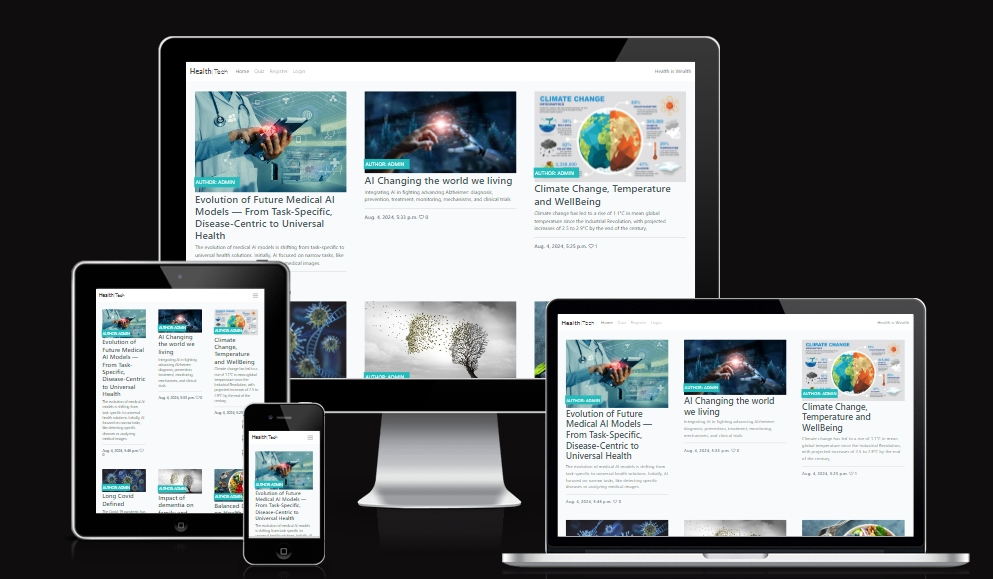)

  * [User Stories](#user-stories)
    + [Post Management](#post-management)
    + [Post Details and Comments](#post-details-and-comments)
    + [Like System](#like-system)
    + [Newsleter and Contact:](#newsleter-and-contact-)
  * [Design](#design)
    + [Colour Scheme](#colour-scheme)
    + [Imagery](#imagery)
    + [Fonts](#fonts)
    + [Wireframes](#wireframes)
- [Agile Methodology](#agile-methodology)
- [Features](#features)
  * [Header](#header)
  * [Home Page](#home-page)
  * [User Account Pages](#user-account-pages)
  * [Blog Main Page](#blog-main-page)
- [Testing](#testing)
- [Deployment - Heroku](#deployment---heroku)
  * [Create the Heroku App:](#create-the-heroku-app-)
  * [Attach the Postgres database:](#attach-the-postgres-database-)
  * [Update Heroku Config Vars](#update-heroku-config-vars)
  * [Deploy](#deploy)
- [Forking this repository](#forking-this-repository)
- [Cloning this repository](#cloning-this-repository)
- [Languages](#languages)
- [Frameworks - Libraries - Programs Used](#frameworks---libraries---programs-used)
- [Credits](#credits)
- [Acknowledgments](#acknowledgments)

<small><i><a href='http://ecotrust-canada.github.io/markdown-toc/'>Table of contents generated with markdown-toc</a></i></small>


### User Stories

#### Post Management
- Given I am logged in, when I visit the post creation page, then I should be able to create a new post with a title, content, and an image.

- Given I am logged in, when I create a post, then the slug should be generated from the title and should be unique.

- Given I am logged in, when I visit my post's edit page, then I should be able to update the content, title, and image.

- Given I am logged in, when I visit my post's detail page, then I should be able to delete my post if I am the author.

#### Post Details and Comments
- Given I am viewing a post, when I visit the post detail page, then I should be able to see the post content, approved comments, and a comment form.

- Given I am logged in, when I submit a comment on a post, then my comment should be saved and appear after approval.

- Given I am the author of a comment, when I visit the comment edit page, then I should be able to update my comment content.

#### Like System
- Given I am logged in, when I visit a post detail page, then I should be able to like or unlike the post.


#### Newsleter and Contact:
- As a store owner, I can add products through an easy-to-use interface so that I can manage the store's contents.


### Design

- Given I visit the newsletter subscription page, when I submit the subscription form, then I should receive a success message and be subscribed to the newsletter.

- Given I visit the contact page, when I submit the contact form, then my message should be saved and I should receive a success message.

#### Colour Scheme

Colour palette from Colors
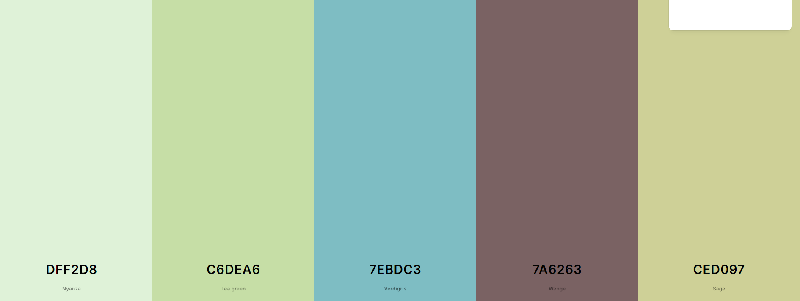)

The color scheme of our blog is thoughtfully crafted using a balanced mix of gold, light grey, and dark grey. These colors are carefully selected to create a neutral yet engaging atmosphere, allowing the blog content and visuals to shine without distractions.

- Gold Accents: Gold accents add a touch of elegance and luxury, evoking a sense of joy and excitement, while staying true to the playful spirit of our blog.

- Light Grey Background: Light grey is used throughout the background to maintain a clean and modern design.

- Dark Grey Elements: Dark grey is employed for text and key sections, ensuring clear readability and visual balance.

We have prioritised strong contrast between the background colors and text to maximize user accessibility. This neutral color palette ensures a user-friendly experience, allowing the blog content to stand out while providing a smooth and enjoyable browsing experience for all visitors.

#### Imagery
Our blog homepage features a prominent static image that showcases an exciting and engaging visual centerpiece. The color scheme of the site, with its vibrant green and yellow tones, perfectly complements this main image, reflecting the playful and imaginative nature of our content.

- Green and Yellow Tones: These colors bring a lively and energetic feel to the site, enhancing the overall user experience.

- Vibrant and Playful: The chosen color scheme reflects the playful and imaginative spirit of our blog, creating an inviting and dynamic environment for our visitors.

By harmonising the main image with the color scheme, we ensure that our blog not only looks appealing but also provides an enjoyable and engaging experience for all users. Our thoughtful design choices help to highlight the creativity and excitement that our content offers
#### Fonts
For the blog, we've chosen to use the Lato font for branding elements, which provides a modern and clean look. Additionally, the Roboto font is used for the body text to ensure optimal readability and a smooth browsing experience. Both fonts are imported via Google Fonts to guarantee a consistent appearance across various devices.

#### Wireframes

<details>
 <summary>Home Page</summary>

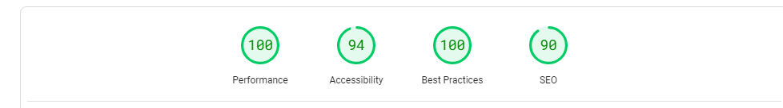
</details>

<details>
 <summary>Blog Page</summary>


</details>


<details>
 <summary>Blog</summary>


</details>

<details>
 <summaryAdd Add a Blog Post></summary>

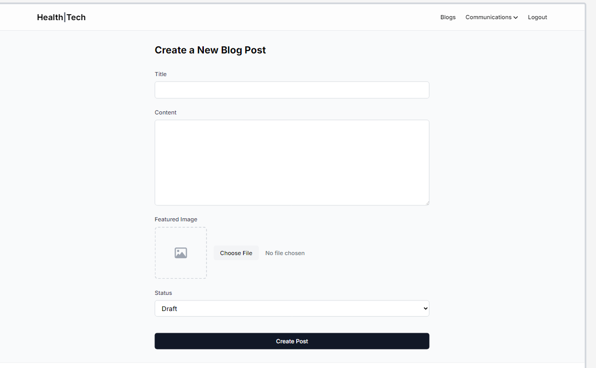
</details>

<details>
 <summary>Log in Page</summary>
 

</details>


<details>
 <summary>Create a post management</summary>

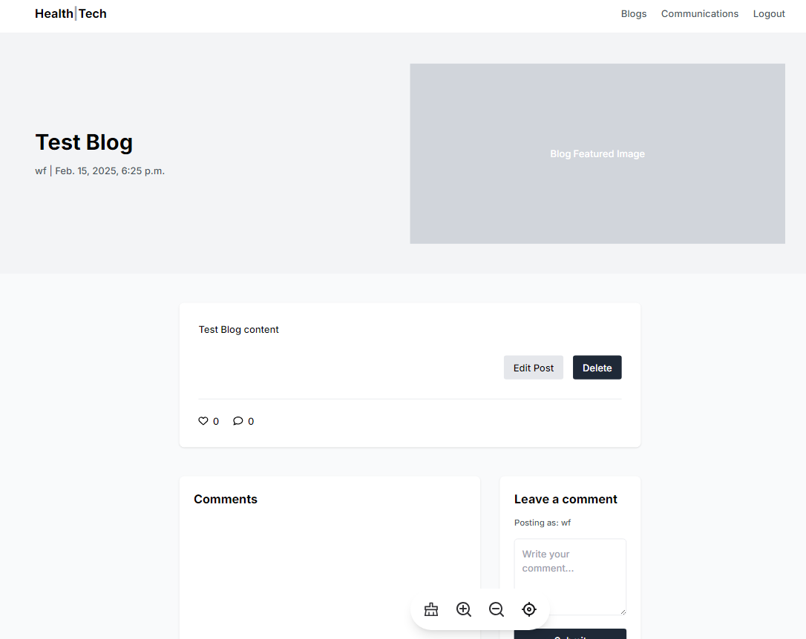
</details>


## Agile Methodology
Github projects was used to manage the development process using an agile approach. Please see link to project board [here](https://github.com/users/SamAkinbile/projects/2/views/1)


## Features

### Header

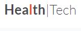

**Logo**
- A customised logo was created using Code Institute template.
- This logo is positioned in the top left of the navigation bar. The logo is linked to the home page for ease of navigation for the user.

**Navigation Bar**

- The navigation bar is visible at the top of every page and includes links to the other pages.

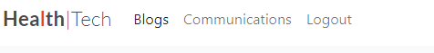


**User Icon**

- The options to Sign up or Log in will change to the option to log out once a user has logged in.


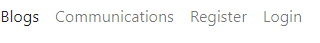

### Home Page

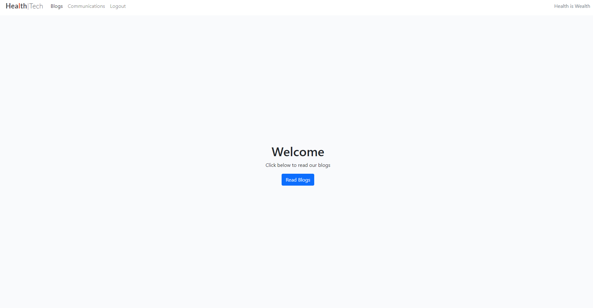

The blog-themed home page showcases an engaging call-to-action section, encouraging visitors to "Read Now" or explore "More Blog Posts." This feature is emphasized with the bold announcement "NEW POSTS," paired with an image of a creatively designed blog layout, inspiring both curiosity and creativity.


### User Account Pages

**Register**

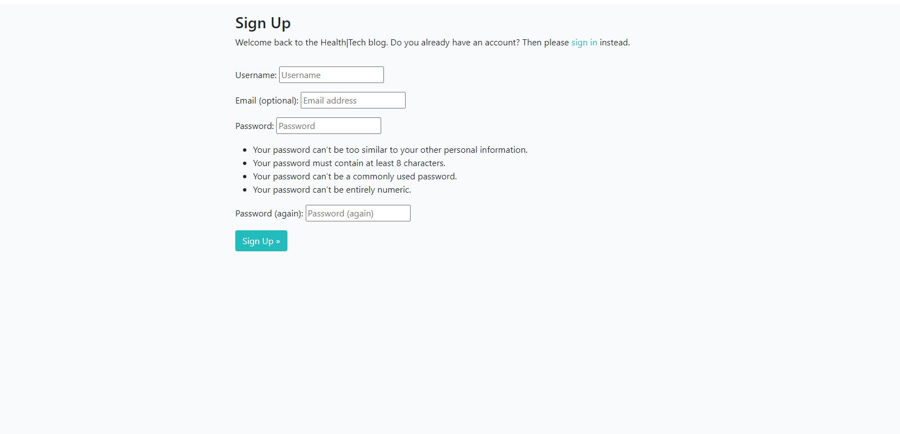

**Sign In**

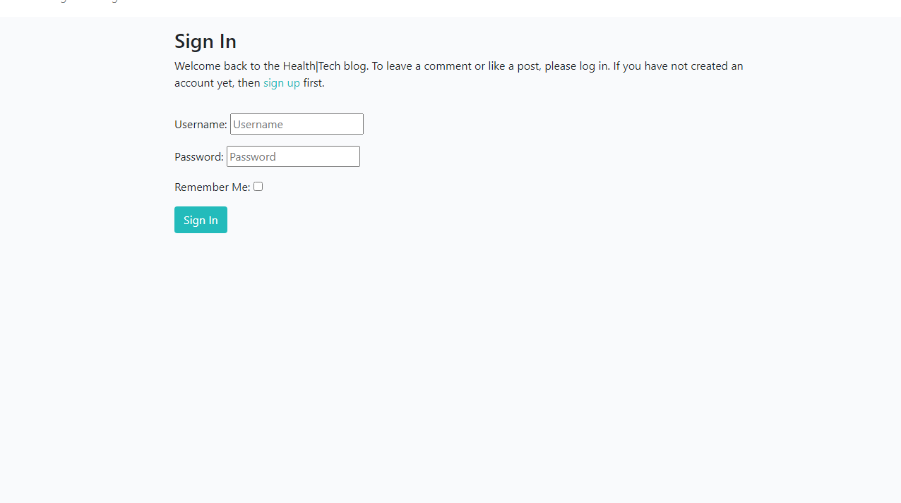


**Sign Out**

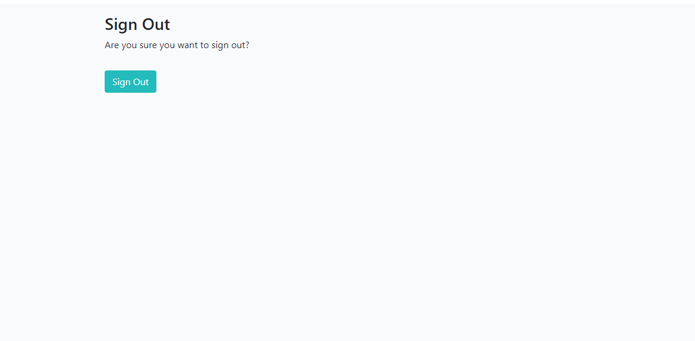

- Django allauth was installed and used to create the Sign up, Log in and Log out functionality. 
- Success messages inform the user if they have logged in/ logged out successfully.


### Blog Main Page
 


- The 'Blog Main Page' link will display a list of all blog post from the database.

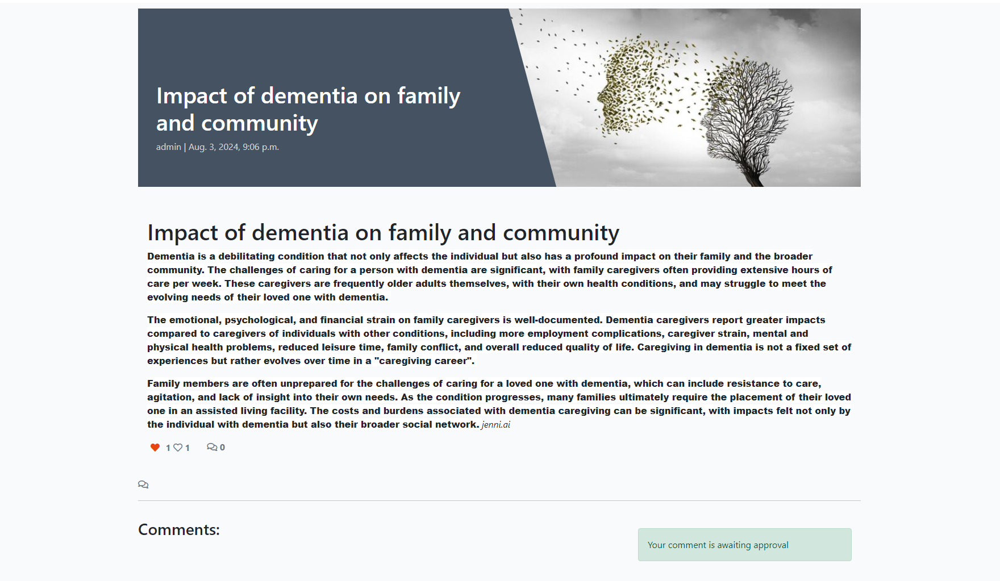

- Each blog shows an image of the product, its title, excerpt,like, comment and edit and delete for logged in user


**Edit|Delete button for Blog post**
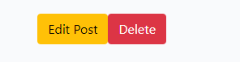

Edit|Delete button for post added. This gives opporturnity for a logged in user to edit, delete, thier blog post.

**Edit|Delete button for comment**
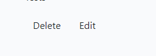

Edit|Delete button for post added. This gives opporturnity for a logged in user to edit, delete, thier comment post.

**Update and Remove Buttons**

**Confirmation**

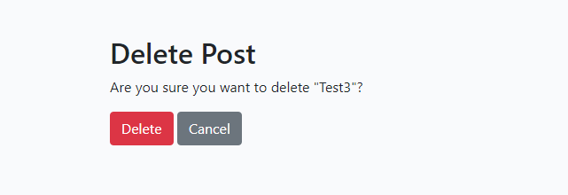
- confirmation if aboiut to delete a blog post

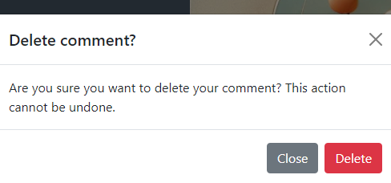
- Confirmation if about to delete a comment post


## Testing
Testing and results can be found [text](TESTING.md)

## Deployment - Heroku

To deploy this page to Heroku from its GitHub repository, the following steps were taken:

### Create the Heroku App:
- Log in to [Heroku](https://dashboard.heroku.com/apps) or create an account.
- On the main page click the button labelled New in the top right corner and from the drop-down menu select "Create New App".
- Enter a unique and meaningful app name.
- Next, select your region.
- Click on the Create App button.

### Attach the Postgres database:
- In the Resources tab, under add-ons, type in Postgres and select the Heroku Postgres option.
- Copy the DATABASE_URL located in Config Vars in the Settings Tab.
- Go back to your IDE and install 2 more requirements:
    - `pip3 install dj_databse_url`
    - `pip3 install psycopg2-binary` 
- Create requirements.txt file by typing `pip3 freeze --local > requirements.txt`
- Add the DATABASE_URL value and your chosen SECRET_KEY value to the env.py file. 
- In settings.py file import dj_database_url, comment out the default configurations within database settings and add the following: 

```
DATABASES = {
    'default': dj_database_url.parse(os.environ.get('DATABASE_URL'))
}
```
- Run migrations and create a superuser for the new database. 
- Create an if statement in settings.py to run the postgres database when using the app on heroku or sqlite if not

```
    if 'DATABASE_URL' in os.environ:
        DATABASES = {
            'default': dj_database_url.parse(os.environ.get('DATABASE_URL'))
        }
    else:
        DATABASES = {
            'default': {
                'ENGINE': 'django.db.backends.sqlite3',
                'NAME': BASE_DIR / 'db.sqlite3',
            }
    }
```

- Create requirements.txt file by typing `pip3 freeze --local > requirements.txt`
- Create a file named "Procfile" in the main directory and add the following: `web: gunicorn project-name.wsgi:application`
- Add Heroku to the ALLOWED_HOSTS list in settings.py in the format ['app_name.heroku.com', 'localhost']

- Push these changes to Github.

### Update Heroku Config Vars
Add the following Config Vars in Heroku:

|     Variable name     |                           Value/where to find value                           |
|:---------------------:|:-----------------------------------------------------------------------------:|
| DATABASE_URL          | Postgres generated (as per step above)                                        |
| EMAIL_HOST_PASS       | Password from email client                                                    |
| EMAIL_HOST_USER       | Site's email address                                                          |
| SECRET_KEY            | Random key generated as above                                                 |


### Deploy
- NB: Ensure in Django settings, DEBUG is False
- Go to the deploy tab on Heroku and connect to GitHub, then to the required repository. 
- Scroll to the bottom of the deploy page and either click Enable Automatic Deploys for automatic deploys or Deploy Branch to deploy manually. Manually deployed branches will need re-deploying each time the repo is updated.
- Click View to view the deployed site.

The site is now live and operational.

## Forking this repository
- Locate the repository at this link [Health Blog](https://github.com/SamAkinbile/HealthTechBlog)
- At the top of the repository, on the right side of the page, select "Fork" from the buttons available. 
- A copy of the repository is now created.

## Cloning this repository
To clone this repository follow the below steps: 

1. Locate the repository at this link [Health Blog](https://github.com/SamAkinbile/HealthTechBlog)
2. Under **'Code'**, see the different cloning options, HTTPS, SSH, and GitHub CLI. Click the prefered cloning option, and then copy the link provided. 
3. Open **Terminal**.
4. In Terminal, change the current working directory to the desired location of the cloned directory.
5. Type **'git clone'**, and then paste the URL copied from GitHub earlier. 
6. Type **'Enter'** to create the local clone. 

## Languages

- Python
- HTML5
- CSS3
- Javascript

## Frameworks - Libraries - Programs Used
- [Django](https://www.djangoproject.com/): Main python framework used in the development of this project
- [Django-allauth](https://django-allauth.readthedocs.io/en/latest/installation.html): authentication library used to create the user accounts
- [JQuery](https://jquery.com/)
- [PostgreSQL](https://www.postgresql.org/) was used as the database for this project.
- [SQLite](https://www.sqlite.org/index.html) - was used as the database during production.
- [Heroku](https://dashboard.heroku.com/login) - was used as the cloud based platform to deploy the site on.
- [Responsinator](http://www.responsinator.com/) - Used to verify responsiveness of website on different devices.
- [Chrome Dev Tools](https://developer.chrome.com/docs/devtools/) - Used for overall development and tweaking, including testing responsiveness and performance.
- [Font Awesome](https://fontawesome.com/) - Used for icons in information bar.
- [GitHub](https://github.com/) - Used for version control and agile tool.
- [Google Fonts](https://fonts.google.com/) - Used to import and alter fonts on the page.
- [W3C](https://www.w3.org/) - Used for HTML & CSS Validation.
- [Jshint](https://jshint.com/) - used to validate javascript
- [Coolors](https://coolors.co/) - Used to create colour palette.
- [Favicon](https://favicon.io/) - Used to create the favicon.
- [Lucidchart](https://lucid.app/documents#/dashboard) - used to create the database schema design
- [Techsini](https://techsini.com/multi-mockup/index.php) - Site mockup generator
- [Crispy Forms](https://django-crispy-forms.readthedocs.io/en/latest/) used to manage Django Forms
- [Bootstrap 4.6](https://getbootstrap.com/docs/4.6/getting-started/introduction/): CSS Framework for developing responsiveness and styling
- [Hatchful](https://hatchful.shopify.com/): Used to generate custom logo
- [Tables Generator](https://www.tablesgenerator.com/markdown_tables): Used to convert excel testing tables to markdown
- [Sitemap Generator](www.xml-sitemaps.com): used to create sitemap.xml 
- [Privacy Policy Generator](https://www.privacypolicygenerator.info/): Used to create the site's privacy policy
- [Mailchimp](https://mailchimp.com/?currency=EUR): Used to create the newsletter signup functionality.
- [chatgpt](openai.com): Openai


## Credits

- [W3Schools](https://www.w3schools.com/)
- [Django Docs](https://docs.djangoproject.com/en/4.0/)
- [Bootstrap 4.6 Docs](https://getbootstrap.com/docs/4.6/getting-started/introduction/)
- [Stack Overflow](https://stackoverflow.com/)
- [Pexels](https://www.pexels.com/): Imagery on the site was sourced from Pexels.com
- [Unsplashed](https://unsplash.com/): Imagery on the site was sourced from Unsplash
- [Code Institute - Codestar Walkthrough Project](https://learn.codeinstitute.net/courses/course-v1:CodeInstitute+FSD101_WTS+5/courseware/713441aba05441dfb3a7cf04f3268b3f/824fccecd0fe4e44871eeabcbf69d830/)
- [Stack Overflow](https://stackoverflow.com/questions/19619428/html5-form-validation-pattern-alphanumeric-with-spaces): To prevent form being submitted with whitespace


## Acknowledgments

Many thanks to Code institute Tutoring service for her support and advice. Thanks to The Code Institute slack community.