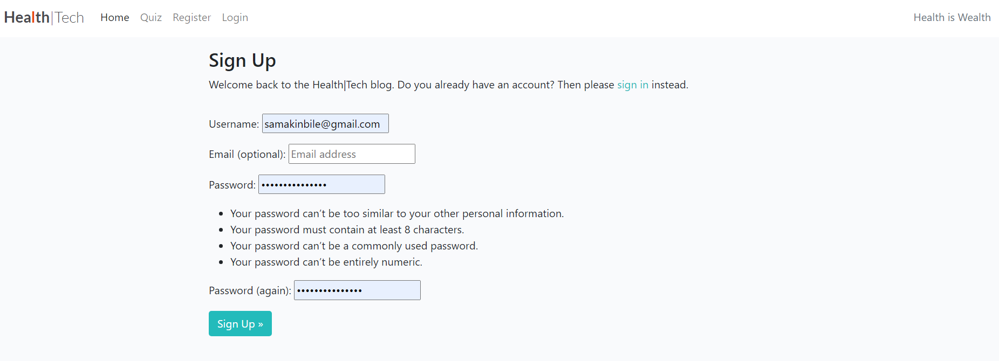

# The Health Tech

The Health Tech is a blog dedicated to exploring health and well-being, delving into the relationship between modern advancements and innovative technology. Discover insightful articles on how the latest tech developments are transforming the health and wellness landscape.

The live link can be found here - [The Health Tech](https://djangoirelandblog-2541e83b59d1.herokuapp.com/)

## Table of Contents

  * [User Experience (UX)](#user-experience-ux)
    + [User Stories](#user-stories)
    + [Design](#design)
  * [Testing](#testing)
  * [Security Features and Defensive Design](#security-features-and-defensive-design)
    + [User Authentication](#user-authentication)
    + [Form Validation](#form-validation)
    + [Database Security](#database-security)
    + [Custom error pages:](#custom-error-pages-)
  * [Features](#features)
    + [Header](#header)
    + [Footer](#footer)
    + [Home Page](#home-page)
    + [User Account Pages](#user-account-pages)
    + [Error Pages](#error-pages)
    + [Future Features](#future-features)
  * [Deployment - Heroku](#deployment---heroku)
  * [Forking this repository](#forking-this-repository)
  * [Cloning this repository](#cloning-this-repository)
  * [Languages](#languages)
  * [Frameworks - Libraries - Programs Used](#frameworks---libraries---programs-used)
  * [Credits](#credits)
  * [Acknowledgments](#acknowledgments)

### User Stories

#### EPIC | User Profile
- As a Health Tech user, I can register an account to add, edit, and delete my health tips, and comment on others' posts, and add entries to my wellness planner.
- As a Health Tech user, I can log in or out to keep my account secure.
-As a Health Tech user, I can see my login status to know if I’m logged in or out.
- Quiz is for avaliable as well.

#### EPIC | Site Administration
- As a Site Administrator, I can create, read, update and delete blogs, comments and likes so that I can manage the app content.

#### User stories not yet implemented

The following user stories were scoped out of the project due to time constraints and labelled as "Won't Have" on the project board on Github. It is intended that these user stories will be implemented at a later date. 

- As a Site User, I can search words about an articule or blog  so that I can find the one I want.

### Design

Health Tech features a simple and clean design, intentionally chosen to align with the site’s goal of promoting calmness and reducing stress. This aesthetic complements our mission of enhancing well-being through the informations by blogs.

## Testing

-Through pep 8
            -validator at w3school

## Security Features and Defensive Design

### User Authentication

- Django's LoginRequiredMixin is used to make sure that any requests to access secure pages by non-authenticated users are redirected to the login page. 
- Django's UserPassesTestMixin is used to limit access based on certain permissions i.e. to ensure users can only edit/delete recipes and comments for which they are the author. If the user doesn't pass the test they are shown an HTTP 403 Forbidden error.

### Form Validation
If incorrect or empty data is added to a form, the form won't submit and a warning will appear to the user informing them what field raised the error. 

### Database Security
The database url and secret key are stored in the env.py file to prevent unwanted connections to the database and this was set up before the first push to Github.

Cross-Site Request Forgery (CSRF) tokens were used on all forms throughout this site.

### Custom error pages:

Custom Error Pages were created to give the user more information on the error and to provide them with buttons to guide them back to the site.

- 400 Bad Request - The Easy Eater is unable to handle this request.
- 403 Page Forbidden - Looks like you're trying to access forbidden content. Please log out and sign in to the correct account.
- 404 Page Not Found - The page you're looking for doesn't exist.
- 500 Server Error - The Easy Eater is currently unable to handle this request

## Features

### Header

**Navigation Bar**

- The navigation bar is present at the top of every page and includes all links to the various other pages.
- The My Account navigation link is a drop down menu which includes the Sign up and Log in links. 
- When the user has logged in, the My Account drop down menu changes to display the user's name and a profile icon.

### Footer

- The footer section includes links to Facebook, Instagram, Twitter and Youtube.
- Clicking the links in the footer opens a separate browser tab to avoid pulling the user away from the site.

### Home Page

- The sign up button changes to a 'Create' button which takes the user to the 'Add recipe' page. 

### User Account Pages

**Sign Up**

**Log In**

**Log Out**

- Django allauth was installed and used to create the Sign up, Log in and Log out functionality. 
- Success messages inform the user if they have logged in/ logged out successfully.

### Home Page

- This page displays all blogs which the logged in user has created.
- Each blogs displays the title's image,  and the articules. 
- If a user tries to get more info about a blog. Users can go to the bottom of the page to check for more infomationa about the articules.

## Deployment - Heroku

To deploy this page to Heroku from its GitHub repository, the following steps were taken:

### Create the Heroku App:
- Log in to [Heroku](https://dashboard.heroku.com/apps) or create an account.
- On the main page click the button labelled New in the top right corner and from the drop-down menu select "Create New App".
- Enter a unique and meaningful app name.
- Next select your region.
- Click on the Create App button.

### Attach the Postgres database:
- In the Resources tab, under add-ons, type in Postgres and select the Heroku Postgres option.
- Copy the DATABASE_URL located in Config Vars in the Settings Tab.

### Prepare the environment and settings.py file:
- In your GitPod workspace, create an env.py file in the main directory.
- Add the DATABASE_URL value and your chosen SECRET_KEY value to the env.py file. 
- Update the settings.py file to import the env.py file and add the SECRETKEY and DATABASE_URL file paths.
- Comment out the default database configuration.
- Save files and make migrations.
- Add Cloudinary URL to env.py
- Add the cloudinary libraries to the list of installed apps.
- Add the STATIC files settings - the url, storage path, directory path, root path, media url and default file storage path.
- Link the file to the templates directory in Heroku.
- Change the templates directory to TEMPLATES_DIR
- Add Heroku to the ALLOWED_HOSTS list the format ['app_name.heroku.com', 'localhost']

### Create files / directories
- Create requirements.txt file
- Create three directories in the main directory; media, storage and templates.
- Create a file named "Procfile" in the main directory and add the following: web: gunicorn project-name.wsgi

### Update Heroku Config Vars
Add the following Config Vars in Heroku:
- SECRET_KEY value 
- CLOUDINARY_URL
- PORT = 8000
- DISABLE_COLLECTSTATIC = 1

### Deploy
- NB: Ensure in Django settings, DEBUG is False
- Go to the deploy tab on Heroku and connect to GitHub, then to the required repository. 
- Scroll to the bottom of the deploy page and either click Enable Automatic Deploys for automatic deploys or Deploy Branch to deploy manually. Manually deployed branches will need re-deploying each time the repo is updated.
- Click View to view the deployed site.

The site is now live and operational.
## Forking this repository
-  Locate the repository at this link [health tech](https://github.com/SamAkinbile/DjangoBlog?tab=readme-ov-file#home-page)
- At the top of the repository, on the right side of the page, select "Fork" from the buttons available. 
- A copy of the repository is now created.

## Cloning this repository
To clone this repository follow the below steps: 

1. Locate the repository at this link [health tech](https://github.com/SamAkinbile/DjangoBlog?tab=readme-ov-file#home-page). 
2. Under **'Code'**, see the different cloning options, HTTPS, SSH, and GitHub CLI. Click the prefered cloning option, and then copy the link provided. 
3. Open **Terminal**.
4. In Terminal, change the current working directory to the desired location of the cloned directory.
5. Type **'git clone'**, and then paste the URL copied from GitHub earlier. 
6. Type **'Enter'** to create the local clone. 

## Languages

- Python
- HTML
- CSS
- Javascript
- Boostrap

## Frameworks - Libraries - Programs Used
- [Django](https://www.djangoproject.com/): Main python framework used in the development of this project
- [Django-allauth](https://django-allauth.readthedocs.io/en/latest/installation.html): authentication library used to create the user accounts
- [PostgreSQL](https://www.postgresql.org/) was used as the database for this project.
- [Heroku](https://dashboard.heroku.com/login) - was used as the cloud based platform to deploy the site on.
- [Responsinator](http://www.responsinator.com/) - Used to verify responsiveness of website on different devices.
- [Balsamiq](https://balsamiq.com/) - Used to generate Wireframe images.
- [Chrome Dev Tools](https://developer.chrome.com/docs/devtools/) - Used for overall development and tweaking, including testing responsiveness and performance.
- [GitHub](https://github.com/) - Used for version control and agile tool.
- [Google Fonts](https://fonts.google.com/) - Used to import and alter fonts on the page.
- [W3C](https://www.w3.org/) - Used for HTML & CSS Validation.
- [PEP8 Online](http://pep8online.com/) - used to validate all the Python code
- [Jshint](https://jshint.com/) - used to validate javascript
- [Coolors](https://coolors.co/) - Used to create colour palette.
- [Favicon](https://favicon.io/) - Used to create the favicon.
- [Summernote](https://summernote.org/): A WYSIWYG editor to allow users to edit their posts
- [Techsini](https://techsini.com/multi-mockup/index.php) - Site mockup generator
- [Crispy Forms](https://django-crispy-forms.readthedocs.io/en/latest/) used to manage Django Forms
- [Cloudinary](https://cloudinary.com/): the image hosting service used to upload images
- [Bootstrap 4.6](https://getbootstrap.com/docs/4.6/getting-started/introduction/): CSS Framework for developing responsiveness and styling
- [Hatchful](https://hatchful.shopify.com/): Used to generate custom logo
- [Tables Generator](https://www.tablesgenerator.com/markdown_tables): Used to convert excel testing tables to markdown

## Credits

- [W3Schools](https://www.w3schools.com/)
- [Django Docs](https://docs.djangoproject.com/en/4.0/)
- [Bootstrap 4.6 Docs](https://getbootstrap.com/docs/4.6/getting-started/introduction/)
- [Stack Overflow](https://stackoverflow.com/)
- [google image](https://www.google.com/): All imagery on the site was sourced and commercialy licenced from google.com
- [science direct](https://www.sciencedirect.com/): Articules based on science
- [Medical Journal](https://pytutorial.com/django-updateview-example)
- [Pagination](https://docs.djangoproject.com/en/2.2/topics/pagination/#using-paginator-in-a-view)
- [AutoSlugField](https://django-extensions.readthedocs.io/en/latest/field_extensions.html)
- [Code Institute - Blog Walkthrough Project](https://github.com/Code-Institute-Solutions/Django3blog)

## Acknowledgments

Here’s a revised version of your message:

---

I am deeply grateful to God for helping me through Project 4, which proved to be quite challenging without much support from the team. My mentor’s availability was inconsistent; on some days, he was willing to help, while on others, he was less responsive and unhelpful. Despite explaining how difficult I found this project, and his acknowledgment of the challenge, no additional assistance was provided.

The struggle to get this project to its current state was significant and stressful. At one point, I reached out to my previous mentor for help with a specific error I was encountering. I am especially thankful to Eva, John, and Sarah for their patience and support on Sunday, as they guided me through resolving the error step-by-step.

