# Testing

## Code Validation  
- [PYTHON VALIDATION](#python-validation)  
- [CSS](#css)  
## Lighthouse Audit  
- [Lighthouse Audit](#lighthouse-audit)    
## Manual Testing  
- [Manual Testing](#manual-testing)  
## NavBar, NavLinks, NavButtons  
- [NavBar, NavLinks, NavButtons](#navbar-navlinks-navbuttons)  
  - [Communications Dropdown Menu](#communications-dropdown-menu)  
## Blog Posts, Comments, Edit and Delete Options, Approving of Comments  
- [Blog Posts, Comments, Edit and Delete Options, Approving of Comments](#blog-posts-comments-edit-and-delete-options-approving-of-comments)  
  - [CRUD Testing](#crud-testing)  
  - [Post Management](#post-management)  
  - [Comment Management](#comment-management)  
  - [Authorization Tests](#authorization-tests)  
  - [Edge Cases](#edge-cases)  

## User Authentication  
- [Sign Up page](#sign-up-page)  
- [Sign In page](#sign-in-page)  

---

<small><i>[Table of contents generated with markdown-toc](http://ecotrust-canada.github.io/markdown-toc/)</i></small>

# Testing

Return back to the [README.md](README.md) file.

## Code Validation

I have used the recommended [HTML W3C Validator](https://validator.w3.org/nu/#textarea) to validate all of my HTML files.

| Page             |    W3C Screnshots                                                             |             
| -----------------|-------------------------------------------------------------------------------|
| Welcome Page     |  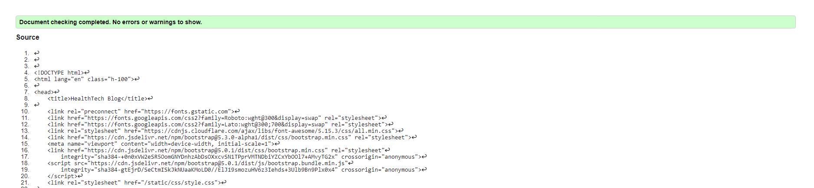                            |
| Blog Main Page   |                              |            
| Blog Page        |                              |
| Sign in Page     |                              |
| Sign up Page     |                              |
| Add a Blog post  |                              |
| Edit Blog        |                              |

### PYTHON VALIDATION
Python testing was done using CI Python Linter to ensure there were no syntax errors.

| App           |        Screenshots                                     |                |
|---------------|--------------------------------------------------------|----------------|
|  Blog         | 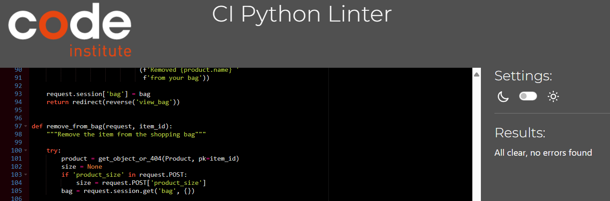               | No error       |
|  codestar     |               | No error       |  

### CSS

I have used the recommended [CSS Jigsaw Validator](https://jigsaw.w3.org/css-validator) to validate all of my CSS files.

|  File      | Jigsaw Screenshot                                                         |  Note
|------------|---------------------------------------------------------------------------|-------------------
| style.css  |   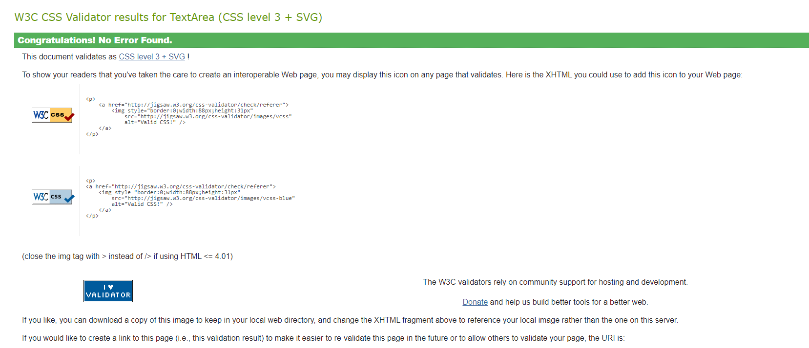        |  No error
                                                    

## Lighthouse Audit

I've tested my deployed project using the Lighthouse Audit tool to check for any major issues.

| Page                 |  Size   |      Screenshot                                          |  
|----------------------|---------|----------------------------------------------------------|
|   Welcome            | Mobile  |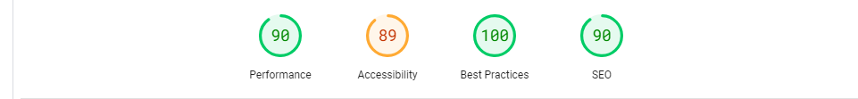            |
|   Welcome            | Desktop | 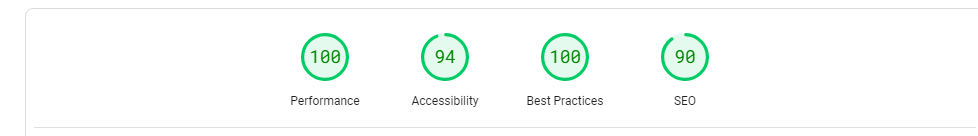            |
| Blog                 |Mobile   |            |
| Blog                 | Desktop |             |
|  add a blog          |Mobile   |            |
|  Add a blog          | Desktop |             |
| 

## Manual Testing

## NavBar, NavLinks, NavButtons 

| Tested Item | Expected Outcome                                      | Outcome     |                                           |
| ----------- | ----------------------------------------------------- | ----------- |-------------------------------------------|
| Home        | Clickable, HealthTeah                                 | as expected | 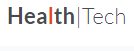|
| NavLink     | Opens Home page,                                      | as expected |                                           |
|             | Or refreshes it if user is already on Home page,      | as expected |                                           |
|             | Color of Welcome page NavLink darkens                 | as expected |                                           |
|             | once it's selected,Opens in the current tab           | as expected |                                           |
|Communication| Clickable,                                            | asexpected |                                            |
| NavLink     | A dropdown nav: contact us, newsletter,               | as expected | 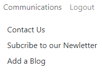                  |
|             | add a blog post                                       | as expected |                                           |
|             |                                                       | as expected |                                           |
|             |                                                       | as expected |                                           |
|             |                                                       |             |                                           |
| Log  In     | Clickable,                                            | as expected |                                           |
| NavLink     | Visible only when user is not logged In,              | as expected |                                           |
|             | Opens up a log In form,                               | as expected | 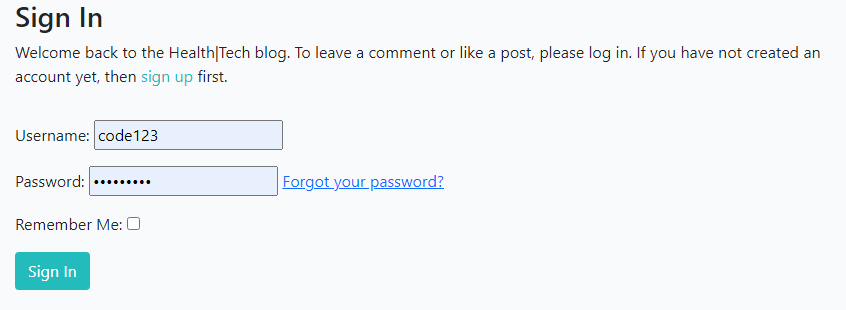                 |
|             | which shows an option to Sign Up if no account,       | as expected |                                           |
|             | Color of Sign In NavLink darkens once it's selected,  | as expected |                                           |
|             | Once logged in, logged Out replaces Sign In on NavBar,| as expected |                                           |
|             | Message appears "Successfully signed in as (username)"| as expected |                                           |
|             | logged in as (username) appears on the right side,    | as expected |
|             | And is visible on all pages while user is signed in,  | as expected |
|             | Sign Up option is visible if not signed in.           | as expected |
|             |                                                       |             |
| Sign Out    | Logged Out is visible only when user is Signed In,    | as expected |
| NavLink     | Color of Sign Out NavLink darkens once it's selected, | as expected |
|             | Opens in the current tab,                             | as expected | 
|             | Sign Out form Opens with an option to Sign Out,       | as expected |
|             | Or refreshes the Sign Out page if user already on Sign| as expected |
|             | Out page,                                             |             |
|             | Sign Out option remains on the page,                  | as expected |
|             | for the user until Sign Out button is clicked,        |             |
|             | after which message pops up: "You have signed out.",  | as expected |
|             | And Log In option appears instead of Log Out,         | as expected |
|             | And now on the right side can see "Not signed in",    | as expected |
|             | And Sign Up option is now available in NavBar         | as expected |
|             |                                                       |             |
|             |                                                       |             |
| NEXT >>     | Visible only on Home page (accessed via               | as expected |
|             | Home page or Logo),                                   |             |
|             | Clickable,                                            | as expected |
|             | Available to user when signed in,                     | as expected |
|             | And when not signed in,                               | as expected |
|             | On the next page << PREV NavButton appears instead    | as expected |
|             |                                                       |             |
| << PREV     | Visible only on Home page after NEXT >> is clicked,   | as expected |
|             | And the user can see the next page,                   |             |
|             | Clickable,                                            | as expected |
|             | Available to user when signed in,                     | as expected |
|             | And when not signed in,                               | as expected |
|             | << PREV is replaced by NEXT >> on the first Home page | as expected |
|             |                                                       |             |
| NavBar Text | Not Clickable,                                        | as expected |
|             | Health is Wealth,                                     | as expected |
|             | Visible in bottom centre on all pages                 | as expected |

### Communications Dropdown Menu

 **Tested Item**               | **Expected Outcome**                          | **Outcome**     |
|--------------------------------|----------------------------------------------|-----------------|
| **Dropdown Menu**              |                                              |                 |
| Dropdown Toggle                | Clickable, opens dropdown menu               | as expected     |
| Dropdown Items                 | All items visible when toggled               | as expected     |
| **Contact Us Link**            |                                              |                 |
| Contact Us Link                | Clickable, opens Contact Us page             | as expected     |
| Contact Us Form                | Displays form for inquiries                  | as expected     |
| Form Submission                | Submits with valid input                     | as expected     |
| Form Validation                | Displays errors for invalid inputs           | as expected     |
| **Subscribe to Newsletter Link**|                                              |                 |
| Newsletter Link                | Clickable, opens Newsletter page             | as expected     |
| Newsletter Form                | Displays form for subscription               | as expected     |
| Form Submission                | Submits with valid email                     | as expected     |
| Form Validation                | Displays errors for invalid inputs           | as expected     |
| **Add a Blog Link**            |                                              |                 |
| Add a Blog Link                | Clickable, opens Blog Creation page          | as expected     |
| Add a Blog Form                | Displays form for blog creation              | as expected     |
| Form Submission                | Submits with valid input                     | as expected     |
| Form Validation                | Displays errors for invalid inputs           | as expected     |

## Blog Posts, Comments, Edit and Delete Options, Approving of Comments

| Tested Item | Expected Outcome                                      | Outcome         |
| ----------- | ----------------------------------------------------- | --------------- |
| **Blog Post** |                                                       |                 |
| Blog Post   | Clickable Blog Post title,                            | as expected     |
|             | Opens in a new tab,                                   | as expected     |
|             | Title, author, time of creation are visible,          | as expected     |
|             | Blog Posts text is visible and clear,                 | as expected     |
|             | Full Image of the blog post is visible                | depend on screen|
|             | beside the title, on different screen sizes,          |                 |
|             | Image of the blog post is visible on different        | depend on screen|
|             | screen sizes,                                         |                 |
|             |                                                       |                 |
| **Comment** |                                                       |                 |
| Comment     | Clickable,                                            | as expected     |
|             | Comment form is visible for logged-in users,          | as expected     |
|             | Comment form is hidden for logged-out users,          | as expected     |
|             | Comments display author name, date, and content,      | as expected     |
|             | Unapproved comments show "awaiting approval" message, | as expected     |
|             | Approved comments are visible to all users,           | as expected     |
|             |                                                       |                 |
| **Edit and Delete Options (Comments)** |                                                       |                 |
| Edit Button | Visible only to comment author,                       | as expected     |
|             | Clickable, opens edit form,                           | as expected     |
|             | Saves changes after editing,                          | as expected     |
| Delete Button | Visible only to comment author,                       | as expected     |
|             | Clickable, deletes comment after confirmation,        | as expected     |
|             |                                                       |                 |
| **Edit and Delete Options (Blog Posts)** |                                                       |                 |
| Edit Button | Visible only to blog post author or admin,            | as expected     |
|             | Clickable, opens edit form,                           | as expected     |
|             | Saves changes after editing,                          | as expected     |
| Delete Button | Visible only to blog post author or admin,            | as expected     |
|             | Clickable, deletes blog post after confirmation,      | as expected     |
|             |                                                       |                 |
| **Approving of Comments** |                                                       |                 |
| Admin Approval | Admin can approve comments from the admin panel,      | as expected     |
|             | Approved comments are visible on the blog post,       | as expected     |
|             | Unapproved comments are hidden from public view,      | as expected     |

- **Blog Post Image:** Depend on the screen sizes.
- **Comment Form:** No issues detected.
- **Edit/Delete Options (Comments):** No issues detected.
- **Edit/Delete Options (Blog Posts):** No issues detected.
- **Approving Comments:** No issues detected.

### CRUD Testing

### **Post Management**
| **Operation** | **Test Case**                     | **Expected Outcome**                                                                 |
|---------------|-----------------------------------|-------------------------------------------------------------------------------------|
| **Create**    | Create a new post                 | Post saved, success message displayed, redirected to post detail page.             |
| **Update**    | Edit an existing post             | Post updated, success message displayed, redirected to updated post detail page.    |
| **Delete**    | Delete an existing post           | Post deleted, success message displayed, redirected to blog page.                  |

### **Comment Management**
| **Operation** | **Test Case**                     | **Expected Outcome**                                                                 |
|---------------|-----------------------------------|-------------------------------------------------------------------------------------|
| **Create**    | Add a comment to a post           | Comment saved, displayed on post detail page after approval.                        |
| **Update**    | Edit an existing comment          | Comment updated, updated comment shown.                                 |
| **Delete**    | Delete an existing comment        | Comment deleted, success message displayed, comment removed from post detail page.  |

### **Authorization Tests**
| **Test Case**                     | **Expected Outcome**                                                                |
|-----------------------------------|-------------------------------------------------------------------------------------|
| Unauthorized post edit            | Error message: "You are not authorized to edit this post."                          |
| Unauthorized post delete          | Error message: "You are not authorized to delete this post."                        |
| Unauthorized comment edit         | Error message: "You can only edit your own comments!"                               |
| Unauthorized comment delete       | Error message: "You can only delete your own comments!"                             |

### **Edge Cases**
| **Test Case**                     | **Expected Outcome**                                                                |
|-----------------------------------|-------------------------------------------------------------------------------------|
| Create post with duplicate title  | Slug modified to ensure uniqueness (e.g., `title-1`, `title-2`).                    |
| Save post as draft                | Post saved as draft, message: "Your draft blog has been saved."                     |

## Sign Up page

| Tested Item | Expected Outcome                                                 | Outcome     |
| ----------- | ---------------------------------------------------------------- | ----------- |
| Sign Up     | Logo, NavBar, NavLinks, NavText displayed,                       | as expected |
| page        | or NavLinks and NavText in the Side Menu,                        | as expected |
|             | if smaller screen                                                | as expected |
|             | On the right,                                                    | as expected |
|             | below Side Menu or NavText,                                      | as expected |
|             | 'Not signed in' is displayed.                                    | as expected |
|             |                                                                  |             |
|             | Below Sign Up Title, text Welcomes users,                        | as expected |
|             | gives an option to 'Sign In' if user already has an account,     | as expected |
|             | with a clickable 'Sign In' link.                                 | as expected |
|             |                                                                  |             |
| Sign Up     | Sign Up form is displayed,                                       | as expected |
| Form        | with Username, Email, Password, Password(again) fields,          | as expected |
|             | and grayed out field names where Visitor can type.               | as expected |
|             |                                                                  |             |
| Username    | Visitor can type in what Username they would like.               | as expected |
|             | Username is required, even though there's no asterisk            | as expected |
|             | highlighting that Username is required.                          | as expected |
|             | When cursor is on Username field,                                | as expected |
|             | 'Please fill in this field' appears below the field.             | as expected |
|             | Letters, Numbers and certain special characters are allowed.     | as expected |
|             | If different special characters are entered,                     | as expected |
|             | Notice appears above Username field:                             | as expected |
|             | 'Enter a valid username. This value may contain only letters,    | as expected |
|             | numbers, and @/./+/-/_ characters.'                              |             |
|             |                                                                  |             |
|             | If Username is entered and 'Sign Up' clicked,                    | as expected |
|             | without filling in Password fields,                              | as expected |
|             | "Please fill in this field" pops up below Password field.        | as expected |
|             |                                                                  |             |
|             | If nothing is entered in Username field,                         | as expected |
|             | and user clicks on 'Sign Up' button,                             | as expected |
|             | pop up appears near Username field: "Please fill in this field." | as expected |
|             |                                                                  |             |
|             | When User has tried a few Usernames to sign up with,             | as expected |
|             | these Usernames show up as options, when cursor is in Username   | as expected |
|             | field,                                                           |             |
|             | and User has an option to choose one of them,                    | as expected |
|             | by moving cursor to the selected one,                            | as expected |
|             | and clicking on it,                                              | as expected |
|             | and selected Username then appears in Username field.            | as expected |
|             | If this Username is already not taken by someone else,           | as expected |
|             | User can sign up with that Username.                             | as expected |
|             | If this Username is already taken by someone else,               | as expected |
|             | and new User clicks on 'Sign Up' button, with that Username      | as expected |
|             | displayed on their Username field,                               | as expected |
|             | message will show above Username:                                | as expected |
|             | "A user with that username already exists."                      | as expected |
|             | User can try to sign up with a different Username then.          | as expected |
|             |                                                                  |             |
|             |                                                                  |             |
| Email       | Email field is optional,                                         | as expected |
| (optional)  | User can type in their email,                                    | as expected |
|             | or leave it blank.                                               | as expected |
|             | If Visitor chooses to fill in email:                             | as expected |
|             | pop up appears if no text before '@' in the email:               | as expected |
|             | "Please enter a part followed by '@'. '@...' is incomplete"      | as expected |
|             | pop up appears when no '@' in the email:                         | as expected |
|             | "Please include an '@' in the email...",                         | as expected |
|             | pop up appears if no text after '@' in the email:                | as expected |
|             | "Please enter a part following '@'. '...@' is incomplete".       | as expected |
|             | Suggestions for email are displayed below the Email field,       | as expected |
|             | while adjusting email to match the requirements,                 | as expected |
|             | even before clicking on 'Sign Up'                                | as expected |
|             |                                                                  |             |
| Password    | Password field is required,                                      | as expected |
|             | even though there's no asterisk                                  | as expected |
|             | highlighting that Password is required.                          | as expected |
|             | User can type in what password they would like,                  | as expected |
|             | all typed password characters, are masked as black dots,         | as expected |
|             | for sercurity.                                                   | as expected |
|             |                                                                  |             |
|             | Below Password field, guidelines for Password are listed.        | as expected |
|             | If Password entered doesn't match Password guidelines,           | as expected |
|             | and user clicks on 'Sign Up' button,                             | as expected |
|             | User is notified of Password not matching guidelines,            | as expected |
|             | and one or more guidelines are shown above the Password field,   | as expected |
|             | Highlighting issues with Users chosen Password,                  | as expected |
|             | even if password macthes some of the guidelines:                 | as expected |
|             |                                                                  |             |
|             | If Password is too short, message above Password field states:   | as expected |
|             | 'This password is too short. It must contain at least            | as expected |
|             | 8 characters.'                                                   |             |
|             |                                                                  |             |
|             | If Password is too common, message above Password field states:  | as expected |
|             | 'This password is too common.'                                   | as expected |
|             |                                                                  |             |
|             | If Password is long enough, yet too similar to the username,     | as expected |
|             | message above Password field states:                             | as expected |
|             | 'This password is too similar to the username.'                  | as expected |
|             |                                                                  |             |
|             | If Password field is left blank,                                 | as expected |
|             | and user clicks on 'Sign Up' button,                             | as expected |
|             | pop up appears near Password field: "Please fill in this field." | as expected |
|             |                                                                  |             |
|             | If Password is only numbers,                                     | as expected |
|             | message above Password field states:                             | as expected |
|             | 'This password is too common.'                                   | as expected |
|             | 'This password is entirely numeric.'                             | as expected |
|             |                                                                  |             |
| Password    | If User does not fill in the Password(again) field,              | as expected |
| (again)     | pop up appears below Password(again) field,                      | as expected |
|             | 'Please fill in this field.'                                     | as expected |
|             |                                                                  |             |
|             | User has an option to correct the Username, Email, Password      | as expected |
|             | and Password(again) mutliple times to try to 'Sign Up'           | as expected |
|             | If Username, Password, Password(again) and Email(if chosen)      | as expected |
|             | are entered as required, and user clicks on 'Sign Up' button,    | as expected |
|             | Home page opens,                                                 | as expected |
|             | "Successfully signed in as ...." is shown below NavBar,          | as expected |
|             | or below logo and Side Menu (on a smaller screen),               | as expected |
|             | "Signed in as ..." is displayed on the rightside below pop-up,   | as expected |
|             | NavBar shows 'Sign Out' instead of 'Sign Up' and 'Sign In'.      | as expected |
|             | and user is now allowed to comment on any published posts.       | as expected |

## Sign In page

| Tested Item | Expected Outcome                                                 | Outcome     |
| ----------- | ---------------------------------------------------------------- | ----------- |
| Sign In     | Logo, NavBar, NavLinks, NavText displayed,                       | as expected |
| page        | or NavLinks and NavText in the Side Menu,                        | as expected |
|             | if smaller screen                                                | as expected |
|             | On the right,                                                    | as expected |
|             | below Side Menu or NavText,                                      | as expected |
|             | 'Not signed in' is displayed.                                    | as expected |
|             |                                                                  |             |
|             | Below Sign In Title, text welcomes users back,                   | as expected |
|             | mentions that comments can be made only when Signed In,          | as expected |
|             | and gives New Users an option to Sign Up.                        | as expected |
|             | Sign Up link is clickable,                                       | as expected |
|             | and brings New users to Sign Up form.                            | as expected |
|             |                                                                  |             |
| Sign In     | Sign In form is displayed,                                       | as expected |
| Form        | Username field is displayed,                                     |             |
|             | with grayed out 'Username' in the box.                           | as expected |
|             |                                                                  |             |
| Username    | User can type in their Username,                                 | as expected |
|             | or choose their Username from the options shown,                 | as expected |
|             | after clicking in Username box,                                  | as expected |
|             | if user has previously opted for 'Remember Me:'                  | as expected |
|             |                                                                  |             |
|             | If incorrect Username is entered,                                | as expected |
|             | and user clicks on 'Sign In' button:                             | as expected |
|             | "The username and/or password you specified are not correct."    | as expected |
|             | appears above 'Username' field                                   | as expected |
|             |                                                                  |             |
|             | If nothing is entered in Username field,                         | as expected |
|             | and user clicks on 'Sign In' button,                             | as expected |
|             | pop up appears near Username field: "Please fill in this field." | as expected |
|             |                                                                  |             |
| Password    | Password field is displayed,                                     | as expected |
|             | User can type in their password,                                 | as expected |
|             | all characters typed, are masked as black dots.                  | as expected |
|             |                                                                  |             |
|             | If incorrect password is entered,                                | as expected |
|             | and user clicks on 'Sign In' button,                             | as expected |
|             | "The username and/or password you specified are not correct."    | as expected |
|             | appears above 'Username field',                                  | as expected |
|             | User has an option to correct the password and try again.        | as expected |
|             |                                                                  |             |
|             | If password field is left blank,                                 | as expected |
|             | and user clicks on 'Sign In' button,                             | as expected |
|             | pop up appears near Password field: "Please fill in this field." | as expected |
|             |                                                                  |             |
|             | User has an option to click in checkbox beside 'Remember Me:'    | as expected |
|             | Check appears in the checkbox if user clicks on it.              | as expected |
|             | 'Sign In' button is available below 'Remember Me:'               | as expected |
|             |                                                                  |             |
|             | If correct Username and correct Password are entered,            | as expected |
|             | and user clicks on 'Sign In' button,                             | as expected |
|             | Home page opens,                                                 | as expected |
|             | "Successfully signed in as ...." pops up below NavBar,           | as expected |
|             | or below logo and Side Menu (on a smaller screen),               | as expected |
|             | "Signed in as ..." is displayed on the rightside below pop-up,   | as expected |
|             | NavBar shows 'Sign Out' instead of 'Sign Up' and 'Sign In'.      | as expected |
|             | and user is now allowed to comment on any published posts.       | as expected |

# Testing

Return back to the [README.md](README.md) file.

## Code Validation

I have used the recommended [HTML W3C Validator](https://validator.w3.org/nu/#textarea) to validate all of my HTML files.Unforturnately, The errors contain in this project comes from walkthrough boutique - ado . I am not able to fix it. I do not have the expertise to do it.

| Page             |    W3C Screnshots                                                             |             
| -----------------|-------------------------------------------------------------------------------|
| Welcome Page     |                              |
| Blog Main Page   |                              |            
| Blog Page        |                              |
| Sign in Page     |                              |
| Sign up Page     |                              |
| Add a Blog post  |                              |
| Edit Blog        |                              |

### PYTHON VALIDATION
Python testing was done using CI Python Linter to ensure there were no syntax errors.

| App           |        Screenshots                                     |                |
|---------------|--------------------------------------------------------|----------------|
|  Blog         |               | No error       |
|  codestar     |               | No error       |  

### CSS

I have used the recommended [CSS Jigsaw Validator](https://jigsaw.w3.org/css-validator) to validate all of my CSS files.

|  File      | Jigsaw Screenshot                                                         |  Note
|------------|---------------------------------------------------------------------------|-------------------
| style.css  |                    |  No error
                                                    

## Lighthouse Audit

I've tested my deployed project using the Lighthouse Audit tool to check for any major issues.

| Page                 |  Size   |      Screenshot                                          |  
|----------------------|---------|----------------------------------------------------------|
|   Welcome            | Mobile  |            |
|   Welcome            | Desktop |             |
| Blog                 |Mobile   |            |
| Blog                 | Desktop |             |
|  add a blog          |Mobile   |            |
|  Add a blog          | Desktop |             |
| 

## Browser Testing

The Website was tested on Google Chrome, Firefox, Safari browsers with no issues noted.

## Manual Testing

## NavBar, NavLinks, NavButtons 

| Tested Item | Expected Outcome                                      | Outcome     |                                           |
| ----------- | ----------------------------------------------------- | ----------- |-------------------------------------------|
| Home        | Clickable, HealthTeah                                 | as expected | |
| NavLink     | Opens Home page,                                      | as expected |                                           |
|             | Or refreshes it if user is already on Home page,      | as expected |                                           |
|             | Color of Welcome page NavLink darkens                 | as expected |                                           |
|             | once it's selected,Opens in the current tab           | as expected |                                           |
|Communication| Clickable,                                            | asexpected |                                            |
| NavLink     | A dropdown nav: contact us, newsletter,               | as expected |                   |
|             | add a blog post                                       | as expected |                                           |
|             |                                                       | as expected |                                           |
|             |                                                       | as expected |                                           |
|             |                                                       |             |                                           |
| Log  In     | Clickable,                                            | as expected |                                           |
| NavLink     | Visible only when user is not logged In,              | as expected |                                           |
|             | Opens up a log In form,                               | as expected |                  |
|             | which shows an option to Sign Up if no account,       | as expected |                                           |
|             | Color of Sign In NavLink darkens once it's selected,  | as expected |                                           |
|             | Once logged in, logged Out replaces Sign In on NavBar,| as expected |                                           |
|             | Message appears "Successfully signed in as (username)"| as expected |                                           |
|             | logged in as (username) appears on the right side,    | as expected |
|             | And is visible on all pages while user is signed in,  | as expected |
|             | Sign Up option is visible if not signed in.           | as expected |
|             |                                                       |             |
| Sign Out    | Logged Out is visible only when user is Signed In,    | as expected |
| NavLink     | Color of Sign Out NavLink darkens once it's selected, | as expected |
|             | Opens in the current tab,                             | as expected | 
|             | Sign Out form Opens with an option to Sign Out,       | as expected |
|             | Or refreshes the Sign Out page if user already on Sign| as expected |
|             | Out page,                                             |             |
|             | Sign Out option remains on the page,                  | as expected |
|             | for the user until Sign Out button is clicked,        |             |
|             | after which message pops up: "You have signed out.",  | as expected |
|             | And Log In option appears instead of Log Out,         | as expected |
|             | And now on the right side can see "Not signed in",    | as expected |
|             | And Sign Up option is now available in NavBar         | as expected |
|             |                                                       |             |
|             |                                                       |             |
| NEXT >>     | Visible only on Home page (accessed via               | as expected |
|             | Home page or Logo),                                   |             |
|             | Clickable,                                            | as expected |
|             | Available to user when signed in,                     | as expected |
|             | And when not signed in,                               | as expected |
|             | On the next page << PREV NavButton appears instead    | as expected |
|             |                                                       |             |
| << PREV     | Visible only on Home page after NEXT >> is clicked,   | as expected |
|             | And the user can see the next page,                   |             |
|             | Clickable,                                            | as expected |
|             | Available to user when signed in,                     | as expected |
|             | And when not signed in,                               | as expected |
|             | << PREV is replaced by NEXT >> on the first Home page | as expected |
|             |                                                       |             |
| NavBar Text | Not Clickable,                                        | as expected |
|             | Health is Wealth,                                     | as expected |
|             | Visible in bottom centre on all pages                 | as expected |

### Communications Dropdown Menu

 **Tested Item**               | **Expected Outcome**                          | **Outcome**     |
|--------------------------------|----------------------------------------------|-----------------|
| **Dropdown Menu**              |                                              |                 |
| Dropdown Toggle                | Clickable, opens dropdown menu               | as expected     |
| Dropdown Items                 | All items visible when toggled               | as expected     |
| **Contact Us Link**            |                                              |                 |
| Contact Us Link                | Clickable, opens Contact Us page             | as expected     |
| Contact Us Form                | Displays form for inquiries                  | as expected     |
| Form Submission                | Submits with valid input                     | as expected     |
| Form Validation                | Displays errors for invalid inputs           | as expected     |
| **Subscribe to Newsletter Link**|                                              |                 |
| Newsletter Link                | Clickable, opens Newsletter page             | as expected     |
| Newsletter Form                | Displays form for subscription               | as expected     |
| Form Submission                | Submits with valid email                     | as expected     |
| Form Validation                | Displays errors for invalid inputs           | as expected     |
| **Add a Blog Link**            |                                              |                 |
| Add a Blog Link                | Clickable, opens Blog Creation page          | as expected     |
| Add a Blog Form                | Displays form for blog creation              | as expected     |
| Form Submission                | Submits with valid input                     | as expected     |
| Form Validation                | Displays errors for invalid inputs           | as expected     |

## Blog Posts, Comments, Edit and Delete Options, Approving of Comments

| Tested Item | Expected Outcome                                      | Outcome         |
| ----------- | ----------------------------------------------------- | --------------- |
| **Blog Post** |                                                       |                 |
| Blog Post   | Clickable Blog Post title,                            | as expected     |
|             | Opens in a new tab,                                   | as expected     |
|             | Title, author, time of creation are visible,          | as expected     |
|             | Blog Posts text is visible and clear,                 | as expected     |
|             | Full Image of the blog post is visible                | depend on screen|
|             | beside the title, on different screen sizes,          |                 |
|             | Image of the blog post is visible on different        | depend on screen|
|             | screen sizes,                                         |                 |
|             |                                                       |                 |
| **Comment** |                                                       |                 |
| Comment     | Clickable,                                            | as expected     |
|             | Comment form is visible for logged-in users,          | as expected     |
|             | Comment form is hidden for logged-out users,          | as expected     |
|             | Comments display author name, date, and content,      | as expected     |
|             | Unapproved comments show "awaiting approval" message, | as expected     |
|             | Approved comments are visible to all users,           | as expected     |
|             |                                                       |                 |
| **Edit and Delete Options (Comments)** |                                                       |                 |
| Edit Button | Visible only to comment author,                       | as expected     |
|             | Clickable, opens edit form,                           | as expected     |
|             | Saves changes after editing,                          | as expected     |
| Delete Button | Visible only to comment author,                       | as expected     |
|             | Clickable, deletes comment after confirmation,        | as expected     |
|             |                                                       |                 |
| **Edit and Delete Options (Blog Posts)** |                                                       |                 |
| Edit Button | Visible only to blog post author or admin,            | as expected     |
|             | Clickable, opens edit form,                           | as expected     |
|             | Saves changes after editing,                          | as expected     |
| Delete Button | Visible only to blog post author or admin,            | as expected     |
|             | Clickable, deletes blog post after confirmation,      | as expected     |
|             |                                                       |                 |
| **Approving of Comments** |                                                       |                 |
| Admin Approval | Admin can approve comments from the admin panel,      | as expected     |
|             | Approved comments are visible on the blog post,       | as expected     |
|             | Unapproved comments are hidden from public view,      | as expected     |

- **Blog Post Image:** Depend on the screen sizes.
- **Comment Form:** No issues detected.
- **Edit/Delete Options (Comments):** No issues detected.
- **Edit/Delete Options (Blog Posts):** No issues detected.
- **Approving Comments:** No issues detected.

### CRUD Testing

### **Post Management**
| **Operation** | **Test Case**                     | **Expected Outcome**                                                                 |
|---------------|-----------------------------------|-------------------------------------------------------------------------------------|
| **Create**    | Create a new post                 | Post saved, success message displayed, redirected to post detail page.             |
| **Update**    | Edit an existing post             | Post updated, success message displayed, redirected to updated post detail page.    |
| **Delete**    | Delete an existing post           | Post deleted, success message displayed, redirected to home page.                  |

### **Comment Management**
| **Operation** | **Test Case**                     | **Expected Outcome**                                                                 |
|---------------|-----------------------------------|-------------------------------------------------------------------------------------|
| **Create**    | Add a comment to a post           | Comment saved, displayed on post detail page after approval.                        |
| **Update**    | Edit an existing comment          | Comment updated, success message displayed, updated comment shown.                  |
| **Delete**    | Delete an existing comment        | Comment deleted, success message displayed, comment removed from post detail page.  |

### **Authorization Tests**
| **Test Case**                     | **Expected Outcome**                                                                 |
|-----------------------------------|-------------------------------------------------------------------------------------|
| Unauthorized post edit            | Error message: "You are not authorized to edit this post."                          |
| Unauthorized post delete          | Error message: "You are not authorized to delete this post."                        |
| Unauthorized comment edit         | Error message: "You can only edit your own comments!"                               |
| Unauthorized comment delete       | Error message: "You can only delete your own comments!"                             |

### **Edge Cases**
| **Test Case**                     | **Expected Outcome**                                                                 |
|-----------------------------------|-------------------------------------------------------------------------------------|
| Create post with duplicate title  | Slug modified to ensure uniqueness (e.g., `title-1`, `title-2`).                   |
| Save post as draft                | Post saved as draft, message: "Your draft blog has been saved."                     |

## Sign Up page

| Tested Item | Expected Outcome                                                 | Outcome     |
| ----------- | ---------------------------------------------------------------- | ----------- |
| Sign Up     | Logo, NavBar, NavLinks, NavText displayed,                       | as expected |
| page        | or NavLinks and NavText in the Side Menu,                        | as expected |
|             | if smaller screen                                                | as expected |
|             | On the right,                                                    | as expected |
|             | below Side Menu or NavText,                                      | as expected |
|             | 'Not signed in' is displayed.                                    | as expected |
|             |                                                                  |             |
|             | Below Sign Up Title, text Welcomes users,                        | as expected |
|             | gives an option to 'Sign In' if user already has an account,     | as expected |
|             | with a clickable 'Sign In' link.                                 | as expected |
|             |                                                                  |             |
| Sign Up     | Sign Up form is displayed,                                       | as expected |
| Form        | with Username, Email, Password, Password(again) fields,          | as expected |
|             | and grayed out field names where Visitor can type.               | as expected |
|             |                                                                  |             |
| Username    | Visitor can type in what Username they would like.               | as expected |
|             | Username is required, even though there's no asterisk            | as expected |
|             | highlighting that Username is required.                          | as expected |
|             | When cursor is on Username field,                                | as expected |
|             | 'Please fill in this field' appears below the field.             | as expected |
|             | Letters, Numbers and certain special characters are allowed.     | as expected |
|             | If different special characters are entered,                     | as expected |
|             | Notice appears above Username field:                             | as expected |
|             | 'Enter a valid username. This value may contain only letters,    | as expected |
|             | numbers, and @/./+/-/_ characters.'                              |             |
|             |                                                                  |             |
|             | If Username is entered and 'Sign Up' clicked,                    | as expected |
|             | without filling in Password fields,                              | as expected |
|             | "Please fill in this field" pops up below Password field.        | as expected |
|             |                                                                  |             |
|             | If nothing is entered in Username field,                         | as expected |
|             | and user clicks on 'Sign Up' button,                             | as expected |
|             | pop up appears near Username field: "Please fill in this field." | as expected |
|             |                                                                  |             |
|             | When User has tried a few Usernames to sign up with,             | as expected |
|             | these Usernames show up as options, when cursor is in Username   | as expected |
|             | field,                                                           |             |
|             | and User has an option to choose one of them,                    | as expected |
|             | by moving cursor to the selected one,                            | as expected |
|             | and clicking on it,                                              | as expected |
|             | and selected Username then appears in Username field.            | as expected |
|             | If this Username is already not taken by someone else,           | as expected |
|             | User can sign up with that Username.                             | as expected |
|             | If this Username is already taken by someone else,               | as expected |
|             | and new User clicks on 'Sign Up' button, with that Username      | as expected |
|             | displayed on their Username field,                               | as expected |
|             | message will show above Username:                                | as expected |
|             | "A user with that username already exists."                      | as expected |
|             | User can try to sign up with a different Username then.          | as expected |
|             |                                                                  |             |
|             |                                                                  |             |
| Email       | Email field is optional,                                         | as expected |
| (optional)  | User can type in their email,                                    | as expected |
|             | or leave it blank.                                               | as expected |
|             | If Visitor chooses to fill in email:                             | as expected |
|             | pop up appears if no text before '@' in the email:               | as expected |
|             | "Please enter a part followed by '@'. '@...' is incomplete"      | as expected |
|             | pop up appears when no '@' in the email:                         | as expected |
|             | "Please include an '@' in the email...",                         | as expected |
|             | pop up appears if no text after '@' in the email:                | as expected |
|             | "Please enter a part following '@'. '...@' is incomplete".       | as expected |
|             | Suggestions for email are displayed below the Email field,       | as expected |
|             | while adjusting email to match the requirements,                 | as expected |
|             | even before clicking on 'Sign Up'                                | as expected |
|             |                                                                  |             |
| Password    | Password field is required,                                      | as expected |
|             | even though there's no asterisk                                  | as expected |
|             | highlighting that Password is required.                          | as expected |
|             | User can type in what password they would like,                  | as expected |
|             | all typed password characters, are masked as black dots,         | as expected |
|             | for sercurity.                                                   | as expected |
|             |                                                                  |             |
|             | Below Password field, guidelines for Password are listed.        | as expected |
|             | If Password entered doesn't match Password guidelines,           | as expected |
|             | and user clicks on 'Sign Up' button,                             | as expected |
|             | User is notified of Password not matching guidelines,            | as expected |
|             | and one or more guidelines are shown above the Password field,   | as expected |
|             | Highlighting issues with Users chosen Password,                  | as expected |
|             | even if password macthes some of the guidelines:                 | as expected |
|             |                                                                  |             |
|             | If Password is too short, message above Password field states:   | as expected |
|             | 'This password is too short. It must contain at least            | as expected |
|             | 8 characters.'                                                   |             |
|             |                                                                  |             |
|             | If Password is too common, message above Password field states:  | as expected |
|             | 'This password is too common.'                                   | as expected |
|             |                                                                  |             |
|             | If Password is long enough, yet too similar to the username,     | as expected |
|             | message above Password field states:                             | as expected |
|             | 'This password is too similar to the username.'                  | as expected |
|             |                                                                  |             |
|             | If Password field is left blank,                                 | as expected |
|             | and user clicks on 'Sign Up' button,                             | as expected |
|             | pop up appears near Password field: "Please fill in this field." | as expected |
|             |                                                                  |             |
|             | If Password is only numbers,                                     | as expected |
|             | message above Password field states:                             | as expected |
|             | 'This password is too common.'                                   | as expected |
|             | 'This password is entirely numeric.'                             | as expected |
|             |                                                                  |             |
| Password    | If User does not fill in the Password(again) field,              | as expected |
| (again)     | pop up appears below Password(again) field,                      | as expected |
|             | 'Please fill in this field.'                                     | as expected |
|             |                                                                  |             |
|             | User has an option to correct the Username, Email, Password      | as expected |
|             | and Password(again) mutliple times to try to 'Sign Up'           | as expected |
|             | If Username, Password, Password(again) and Email(if chosen)      | as expected |
|             | are entered as required, and user clicks on 'Sign Up' button,    | as expected |
|             | Home page opens,                                                 | as expected |
|             | "Successfully signed in as ...." is shown below NavBar,          | as expected |
|             | or below logo and Side Menu (on a smaller screen),               | as expected |
|             | "Signed in as ..." is displayed on the rightside below pop-up,   | as expected |
|             | NavBar shows 'Sign Out' instead of 'Sign Up' and 'Sign In'.      | as expected |
|             | and user is now allowed to comment on any published posts.       | as expected |

## Sign In page

| Tested Item | Expected Outcome                                                 | Outcome     |
| ----------- | ---------------------------------------------------------------- | ----------- |
| Sign In     | Logo, NavBar, NavLinks, NavText displayed,                       | as expected |
| page        | or NavLinks and NavText in the Side Menu,                        | as expected |
|             | if smaller screen                                                | as expected |
|             | On the right,                                                    | as expected |
|             | below Side Menu or NavText,                                      | as expected |
|             | 'Not signed in' is displayed.                                    | as expected |
|             |                                                                  |             |
|             | Below Sign In Title, text welcomes users back,                   | as expected |
|             | mentions that comments can be made only when Signed In,          | as expected |
|             | and gives New Users an option to Sign Up.                        | as expected |
|             | Sign Up link is clickable,                                       | as expected |
|             | and brings New users to Sign Up form.                            | as expected |
|             |                                                                  |             |
| Sign In     | Sign In form is displayed,                                       | as expected |
| Form        | Username field is displayed,                                     |             |
|             | with grayed out 'Username' in the box.                           | as expected |
|             |                                                                  |             |
| Username    | User can type in their Username,                                 | as expected |
|             | or choose their Username from the options shown,                 | as expected |
|             | after clicking in Username box,                                  | as expected |
|             | if user has previously opted for 'Remember Me:'                  | as expected |
|             |                                                                  |             |
|             | If incorrect Username is entered,                                | as expected |
|             | and user clicks on 'Sign In' button:                             | as expected |
|             | "The username and/or password you specified are not correct."    | as expected |
|             | appears above 'Username' field                                   | as expected |
|             |                                                                  |             |
|             | If nothing is entered in Username field,                         | as expected |
|             | and user clicks on 'Sign In' button,                             | as expected |
|             | pop up appears near Username field: "Please fill in this field." | as expected |
|             |                                                                  |             |
| Password    | Password field is displayed,                                     | as expected |
|             | User can type in their password,                                 | as expected |
|             | all characters typed, are masked as black dots.                  | as expected |
|             |                                                                  |             |
|             | If incorrect password is entered,                                | as expected |
|             | and user clicks on 'Sign In' button,                             | as expected |
|             | "The username and/or password you specified are not correct."    | as expected |
|             | appears above 'Username field',                                  | as expected |
|             | User has an option to correct the password and try again.        | as expected |
|             |                                                                  |             |
|             | If password field is left blank,                                 | as expected |
|             | and user clicks on 'Sign In' button,                             | as expected |
|             | pop up appears near Password field: "Please fill in this field." | as expected |
|             |                                                                  |             |
|             | User has an option to click in checkbox beside 'Remember Me:'    | as expected |
|             | Check appears in the checkbox if user clicks on it.              | as expected |
|             | 'Sign In' button is available below 'Remember Me:'               | as expected |
|             |                                                                  |             |
|             | If correct Username and correct Password are entered,            | as expected |
|             | and user clicks on 'Sign In' button,                             | as expected |
|             | Home page opens,                                                 | as expected |
|             | "Successfully signed in as ...." pops up below NavBar,           | as expected |
|             | or below logo and Side Menu (on a smaller screen),               | as expected |
|             | "Signed in as ..." is displayed on the rightside below pop-up,   | as expected |
|             | NavBar shows 'Sign Out' instead of 'Sign Up' and 'Sign In'.      | as expected |
|             | and user is now allowed to comment on any published posts.       | as expected |

# Testing

Return back to the [README.md](README.md) file.

## Code Validation

I have used the recommended [HTML W3C Validator](https://validator.w3.org/nu/#textarea) to validate of my HTML pages that I write.

| Page             |    W3C Screnshots                                                             |             
| -----------------|-------------------------------------------------------------------------------|
| Welcome Page     |                              |
| Blog Page   |                                   |            
| Contact Us       |                              |
| Newsletter Page  |                              |
|  Blog Main Page | 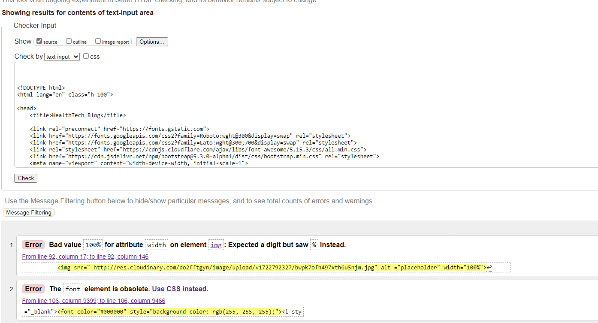                               |
| Add a Blog post  |                              |
| Edit Blog        |                              |

- The errors originate from the walkthrough project, and each main post or blog detail page may contain validation issues when checked.

### PYTHON VALIDATION
Python testing was done using CI Python Linter to ensure there were no syntax errors.

| App           |        Screenshots                                     |                |
|---------------|--------------------------------------------------------|----------------|
|Blog(view.py)  | 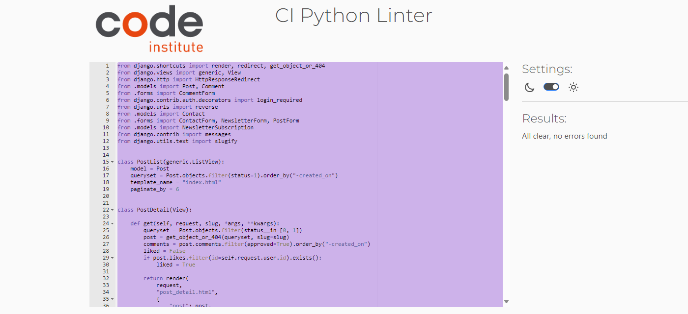        | No error       |
|blog  urls.py  | 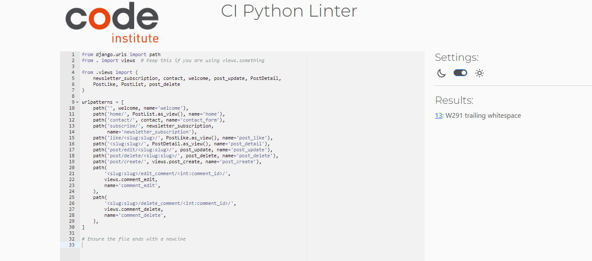        | Tested         |  
| Models.py     | 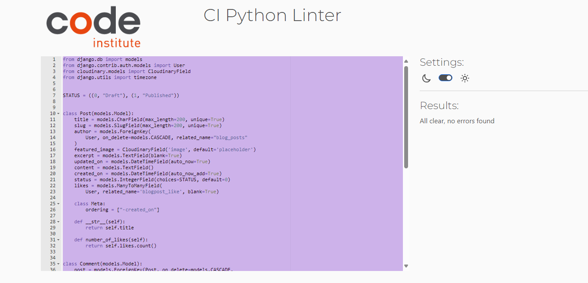           | No error       |
| Forms.py      |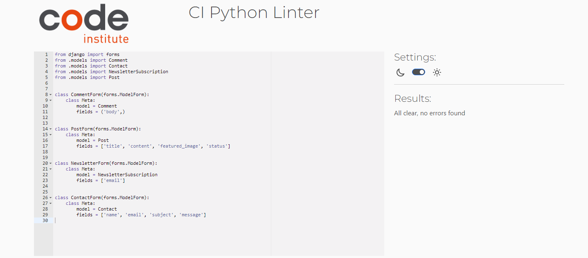             | No error       |    
|Blog(admin)    | .png)     | No error       |
|Codestar(urls) |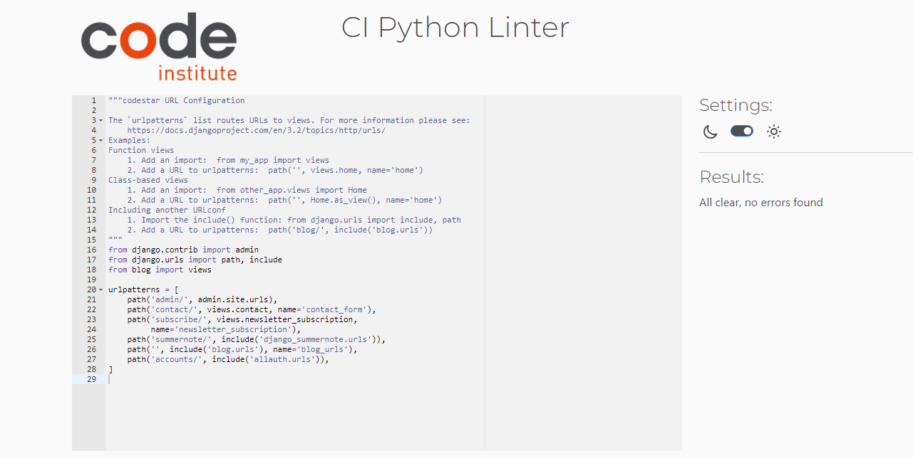        | No error       |  

### CSS

I have used the recommended [CSS Jigsaw Validator](https://jigsaw.w3.org/css-validator) to validate all of my CSS files.

|  File      | Jigsaw Screenshot                                                         |  Note
|------------|---------------------------------------------------------------------------|-------------------
| style.css  |                               |  No error
                                                    

## Lighthouse Audit

I've tested my deployed project using the Lighthouse Audit tool to check for any major issues.

| Page                 |  Size   |      Screenshot                                          |  
|----------------------|---------|----------------------------------------------------------|
|   Welcome            | Mobile  |            |
|   Welcome            | Desktop |             |
| Blog                 |Mobile   |            |
| Blog                 | Desktop |             |
|  add a blog          |Mobile   |            |
|  Add a blog          | Desktop |             |
| 

## Browser Testing

The Website was tested on Google Chrome, Firefox, Safari browsers with no issues noted.

## Manual Testing

## NavBar, NavLinks, NavButtons 

| Tested Item | Expected Outcome                                      | Outcome     |                                           |
| ----------- | ----------------------------------------------------- | ----------- |-------------------------------------------|
| Home        | Clickable, HealthTeah                                 | as expected | |
| NavLink     | Opens Home page,                                      | as expected |                                           |
|             | Or refreshes it if user is already on Home page,      | as expected |                                           |
|             | Color of Welcome page NavLink darkens                 | as expected |                                           |
|             | once it's selected,Opens in the current tab           | as expected |                                           |
|Communication| Clickable,                                            | asexpected |                                            |
| NavLink     | A dropdown nav: contact us, newsletter,               | as expected |                   |
|             | add a blog post                                       | as expected |                                           |
|             |                                                       | as expected |                                           |
|             |                                                       | as expected |                                           |
|             |                                                       |             |                                           |
| Log  In     | Clickable,                                            | as expected |                                           |
| NavLink     | Visible only when user is not logged In,              | as expected |                                           |
|             | Opens up a log In form,                               | as expected |                  |
|             | which shows an option to Sign Up if no account,       | as expected |                                           |
|             | Color of Sign In NavLink darkens once it's selected,  | as expected |                                           |
|             | Once logged in, logged Out replaces Sign In on NavBar,| as expected |                                           |
|             | Message appears "Successfully signed in as (username)"| as expected |                                           |
|             | logged in as (username) appears on the right side,    | as expected |
|             | And is visible on all pages while user is signed in,  | as expected |
|             | Sign Up option is visible if not signed in.           | as expected |
|             |                                                       |             |
| Sign Out    | Logged Out is visible only when user is Signed In,    | as expected |
| NavLink     | Color of Sign Out NavLink darkens once it's selected, | as expected |
|             | Opens in the current tab,                             | as expected | 
|             | Sign Out form Opens with an option to Sign Out,       | as expected |
|             | Or refreshes the Sign Out page if user already on Sign| as expected |
|             | Out page,                                             |             |
|             | Sign Out option remains on the page,                  | as expected |
|             | for the user until Sign Out button is clicked,        |             |
|             | after which message pops up: "You have signed out.",  | as expected |
|             | And Log In option appears instead of Log Out,         | as expected |
|             | And now on the right side can see "Not signed in",    | as expected |
|             | And Sign Up option is now available in NavBar         | as expected |
|             |                                                       |             |
|             |                                                       |             |
| NEXT >>     | Visible only on Home page (accessed via               | as expected |
|             | Home page or Logo),                                   |             |
|             | Clickable,                                            | as expected |
|             | Available to user when signed in,                     | as expected |
|             | And when not signed in,                               | as expected |
|             | On the next page << PREV NavButton appears instead    | as expected |
|             |                                                       |             |
| << PREV     | Visible only on Home page after NEXT >> is clicked,   | as expected |
|             | And the user can see the next page,                   |             |
|             | Clickable,                                            | as expected |
|             | Available to user when signed in,                     | as expected |
|             | And when not signed in,                               | as expected |
|             | << PREV is replaced by NEXT >> on the first Home page | as expected |
|             |                                                       |             |
| NavBar Text | Not Clickable,                                        | as expected |
|             | Health is Wealth,                                     | as expected |
|             | Visible in top right on all pages                     | as expected |

### Communications Dropdown Menu

 **Tested Item**               | **Expected Outcome**                          | **Outcome**     |
|--------------------------------|----------------------------------------------|-----------------|
| **Dropdown Menu**              |                                              |                 |
| Dropdown Toggle                | Clickable, opens dropdown menu               | as expected     |
| Dropdown Items                 | All items visible when toggled               | as expected     |
| **Contact Us Link**            |                                              |                 |
| Contact Us Link                | Clickable, opens Contact Us page             | as expected     |
| Contact Us Form                | Displays form for inquiries                  | as expected     |
| Form Submission                | Submits with valid input                     | as expected     |
| Form Validation                | Displays errors for invalid inputs           | as expected     |
| **Subscribe to Newsletter Link**|                                              |                 |
| Newsletter Link                | Clickable, opens Newsletter page             | as expected     |
| Newsletter Form                | Displays form for subscription               | as expected     |
| Form Submission                | Submits with valid email                     | as expected     |
| Form Validation                | Displays errors for invalid inputs           | as expected     |
| **Add a Blog Link**            |                                              |                 |
| Add a Blog Link                | Clickable, opens Blog Creation page          | as expected     |
| Add a Blog Form                | Displays form for blog creation              | as expected     |
| Form Submission                | Submits with valid input                     | as expected     |
| Form Validation                | Displays errors for invalid inputs           | as expected     |

## Blog Posts, Comments, Edit and Delete Options, Approving of Comments

| Tested Item | Expected Outcome                                      | Outcome         |
| ----------- | ----------------------------------------------------- | --------------- |
| **Blog Post** |                                                       |                 |
| Blog Post   | Clickable Blog Post title,                            | as expected     |
|             | Opens in a new tab,                                   | as expected     |
|             | Title, author, time of creation are visible,          | as expected     |
|             | Blog Posts text is visible and clear,                 | as expected     |
|             | Full Image of the blog post is visible                | depend on screen|
|             | beside the title, on different screen sizes,          |                 |
|             | Image of the blog post is visible on different        | depend on screen|
|             | screen sizes,                                         |                 |
|             |                                                       |                 |
| **Comment** |                                                       |                 |
| Comment     | Clickable,                                            | as expected     |
|             | Comment form is visible for logged-in users,          | as expected     |
|             | Comment form is hidden for logged-out users,          | as expected     |
|             | Comments display author name, date, and content,      | as expected     |
|             | Unapproved comments show "awaiting approval" message, | as expected     |
|             | Approved comments are visible to all users,           | as expected     |
|             |                                                       |                 |
| **Edit and Delete Options (Comments)** |                                                       |                 |
| Edit Button | Visible only to comment author,                       | as expected     |
|             | Clickable, opens edit form,                           | as expected     |
|             | Saves changes after editing,                          | as expected     |
| Delete Button | Visible only to comment author,                       | as expected     |
|             | Clickable, deletes comment after confirmation,        | as expected     |
|             |                                                       |                 |
| **Edit and Delete Options (Blog Posts)** |                                                       |                 |
| Edit Button | Visible only to blog post author or admin,            | as expected     |
|             | Clickable, opens edit form,                           | as expected     |
|             | Saves changes after editing,                          | as expected     |
| Delete Button | Visible only to blog post author or admin,            | as expected     |
|             | Clickable, deletes blog post after confirmation,      | as expected     |
|             |                                                       |                 |
| **Approving of Comments** |                                                       |                 |
| Admin Approval | Admin can approve comments from the admin panel,      | as expected     |
|             | Approved comments are visible on the blog post,       | as expected     |
|             | Unapproved comments are hidden from public view,      | as expected     |

- **Blog Post Image:** Depend on the screen sizes.
- **Comment Form:** No issues detected.
- **Edit/Delete Options (Comments):** No issues detected.
- **Edit/Delete Options (Blog Posts):** No issues detected.
- **Approving Comments:** No issues detected.

### CRUD Testing

### **Post Management**
| **Operation** | **Test Case**                     | **Expected Outcome**                                                                 |
|---------------|-----------------------------------|-------------------------------------------------------------------------------------|
| **Create**    | Create a new post                 | Post saved, success message displayed, redirected to post detail page.             |
| **Update**    | Edit an existing post             | Post updated, success message displayed, redirected to updated post detail page.    |
| **Delete**    | Delete an existing post           | Post deleted, success message displayed, redirected to home page.                  |

### **Comment Management**
| **Operation** | **Test Case**                     | **Expected Outcome**                                                                 |
|---------------|-----------------------------------|-------------------------------------------------------------------------------------|
| **Create**    | Add a comment to a post           | Comment saved, displayed on post detail page after approval.                        |
| **Update**    | Edit an existing comment          | Comment updated, success message displayed, updated comment shown.                  |
| **Delete**    | Delete an existing comment        | Comment deleted, success message displayed, comment removed from post detail page.  |

### **Authorization Tests**
| **Test Case**                     | **Expected Outcome**                                                                 |
|-----------------------------------|-------------------------------------------------------------------------------------|
| Unauthorized post edit            | Error message: "You are not authorized to edit this post."                          |
| Unauthorized post delete          | Error message: "You are not authorized to delete this post."                        |
| Unauthorized comment edit         | Error message: "You can only edit your own comments!"                               |
| Unauthorized comment delete       | Error message: "You can only delete your own comments!"                             |

### **Edge Cases**
| **Test Case**                     | **Expected Outcome**                                                                 |
|-----------------------------------|-------------------------------------------------------------------------------------|
| Create post with duplicate title  | Slug modified to ensure uniqueness (e.g., `title-1`, `title-2`).                   |
| Save post as draft                | Post saved as draft, message: "Your draft blog has been saved."                     |

## Sign Up page

| Tested Item | Expected Outcome                                                 | Outcome     |
| ----------- | ---------------------------------------------------------------- | ----------- |
| Sign Up     | Logo, NavBar, NavLinks, NavText displayed,                       | as expected |
| page        | or NavLinks and NavText in the Side Menu,                        | as expected |
|             | if smaller screen                                                | as expected |
|             | On the right,                                                    | as expected |
|             | below Side Menu or NavText,                                      | as expected |
|             | 'Not signed in' is displayed.                                    | as expected |
|             |                                                                  |             |
|             | Below Sign Up Title, text Welcomes users,                        | as expected |
|             | gives an option to 'Sign In' if user already has an account,     | as expected |
|             | with a clickable 'Sign In' link.                                 | as expected |
|             |                                                                  |             |
| Sign Up     | Sign Up form is displayed,                                       | as expected |
| Form        | with Username, Email, Password, Password(again) fields,          | as expected |
|             | and grayed out field names where Visitor can type.               | as expected |
|             |                                                                  |             |
| Username    | Visitor can type in what Username they would like.               | as expected |
|             | Username is required, even though there's no asterisk            | as expected |
|             | highlighting that Username is required.                          | as expected |
|             | When cursor is on Username field,                                | as expected |
|             | 'Please fill in this field' appears below the field.             | as expected |
|             | Letters, Numbers and certain special characters are allowed.     | as expected |
|             | If different special characters are entered,                     | as expected |
|             | Notice appears above Username field:                             | as expected |
|             | 'Enter a valid username. This value may contain only letters,    | as expected |
|             | numbers, and @/./+/-/_ characters.'                              |             |
|             |                                                                  |             |
|             | If Username is entered and 'Sign Up' clicked,                    | as expected |
|             | without filling in Password fields,                              | as expected |
|             | "Please fill in this field" pops up below Password field.        | as expected |
|             |                                                                  |             |
|             | If nothing is entered in Username field,                         | as expected |
|             | and user clicks on 'Sign Up' button,                             | as expected |
|             | pop up appears near Username field: "Please fill in this field." | as expected |
|             |                                                                  |             |
|             | When User has tried a few Usernames to sign up with,             | as expected |
|             | these Usernames show up as options, when cursor is in Username   | as expected |
|             | field,                                                           |             |
|             | and User has an option to choose one of them,                    | as expected |
|             | by moving cursor to the selected one,                            | as expected |
|             | and clicking on it,                                              | as expected |
|             | and selected Username then appears in Username field.            | as expected |
|             | If this Username is already not taken by someone else,           | as expected |
|             | User can sign up with that Username.                             | as expected |
|             | If this Username is already taken by someone else,               | as expected |
|             | and new User clicks on 'Sign Up' button, with that Username      | as expected |
|             | displayed on their Username field,                               | as expected |
|             | message will show above Username:                                | as expected |
|             | "A user with that username already exists."                      | as expected |
|             | User can try to sign up with a different Username then.          | as expected |
|             |                                                                  |             |
|             |                                                                  |             |
| Email       | Email field is optional,                                         | as expected |
| (optional)  | User can type in their email,                                    | as expected |
|             | or leave it blank.                                               | as expected |
|             | If Visitor chooses to fill in email:                             | as expected |
|             | pop up appears if no text before '@' in the email:               | as expected |
|             | "Please enter a part followed by '@'. '@...' is incomplete"      | as expected |
|             | pop up appears when no '@' in the email:                         | as expected |
|             | "Please include an '@' in the email...",                         | as expected |
|             | pop up appears if no text after '@' in the email:                | as expected |
|             | "Please enter a part following '@'. '...@' is incomplete".       | as expected |
|             | Suggestions for email are displayed below the Email field,       | as expected |
|             | while adjusting email to match the requirements,                 | as expected |
|             | even before clicking on 'Sign Up'                                | as expected |
|             |                                                                  |             |
| Password    | Password field is required,                                      | as expected |
|             | even though there's no asterisk                                  | as expected |
|             | highlighting that Password is required.                          | as expected |
|             | User can type in what password they would like,                  | as expected |
|             | all typed password characters, are masked as black dots,         | as expected |
|             | for sercurity.                                                   | as expected |
|             |                                                                  |             |
|             | Below Password field, guidelines for Password are listed.        | as expected |
|             | If Password entered doesn't match Password guidelines,           | as expected |
|             | and user clicks on 'Sign Up' button,                             | as expected |
|             | User is notified of Password not matching guidelines,            | as expected |
|             | and one or more guidelines are shown above the Password field,   | as expected |
|             | Highlighting issues with Users chosen Password,                  | as expected |
|             | even if password macthes some of the guidelines:                 | as expected |
|             |                                                                  |             |
|             | If Password is too short, message above Password field states:   | as expected |
|             | 'This password is too short. It must contain at least            | as expected |
|             | 8 characters.'                                                   |             |
|             |                                                                  |             |
|             | If Password is too common, message above Password field states:  | as expected |
|             | 'This password is too common.'                                   | as expected |
|             |                                                                  |             |
|             | If Password is long enough, yet too similar to the username,     | as expected |
|             | message above Password field states:                             | as expected |
|             | 'This password is too similar to the username.'                  | as expected |
|             |                                                                  |             |
|             | If Password field is left blank,                                 | as expected |
|             | and user clicks on 'Sign Up' button,                             | as expected |
|             | pop up appears near Password field: "Please fill in this field." | as expected |
|             |                                                                  |             |
|             | If Password is only numbers,                                     | as expected |
|             | message above Password field states:                             | as expected |
|             | 'This password is too common.'                                   | as expected |
|             | 'This password is entirely numeric.'                             | as expected |
|             |                                                                  |             |
| Password    | If User does not fill in the Password(again) field,              | as expected |
| (again)     | pop up appears below Password(again) field,                      | as expected |
|             | 'Please fill in this field.'                                     | as expected |
|             |                                                                  |             |
|             | User has an option to correct the Username, Email, Password      | as expected |
|             | and Password(again) mutliple times to try to 'Sign Up'           | as expected |
|             | If Username, Password, Password(again) and Email(if chosen)      | as expected |
|             | are entered as required, and user clicks on 'Sign Up' button,    | as expected |
|             | Home page opens,                                                 | as expected |
|             | "Successfully signed in as ...." is shown below NavBar,          | as expected |
|             | or below logo and Side Menu (on a smaller screen),               | as expected |
|             | "Signed in as ..." is displayed on the rightside below pop-up,   | as expected |
|             | NavBar shows 'Sign Out' instead of 'Sign Up' and 'Sign In'.      | as expected |
|             | and user is now allowed to comment on any published posts.       | as expected |

## Sign In page

| Tested Item | Expected Outcome                                                 | Outcome     |
| ----------- | ---------------------------------------------------------------- | ----------- |
| Sign In     | Logo, NavBar, NavLinks, NavText displayed,                       | as expected |
| page        | or NavLinks and NavText in the Side Menu,                        | as expected |
|             | if smaller screen                                                | as expected |
|             | On the right,                                                    | as expected |
|             | below Side Menu or NavText,                                      | as expected |
|             | 'Not signed in' is displayed.                                    | as expected |
|             |                                                                  |             |
|             | Below Sign In Title, text welcomes users back,                   | as expected |
|             | mentions that comments can be made only when Signed In,          | as expected |
|             | and gives New Users an option to Sign Up.                        | as expected |
|             | Sign Up link is clickable,                                       | as expected |
|             | and brings New users to Sign Up form.                            | as expected |
|             |                                                                  |             |
| Sign In     | Sign In form is displayed,                                       | as expected |
| Form        | Username field is displayed,                                     |             |
|             | with grayed out 'Username' in the box.                           | as expected |
|             |                                                                  |             |
| Username    | User can type in their Username,                                 | as expected |
|             | or choose their Username from the options shown,                 | as expected |
|             | after clicking in Username box,                                  | as expected |
|             | if user has previously opted for 'Remember Me:'                  | as expected |
|             |                                                                  |             |
|             | If incorrect Username is entered,                                | as expected |
|             | and user clicks on 'Sign In' button:                             | as expected |
|             | "The username and/or password you specified are not correct."    | as expected |
|             | appears above 'Username' field                                   | as expected |
|             |                                                                  |             |
|             | If nothing is entered in Username field,                         | as expected |
|             | and user clicks on 'Sign In' button,                             | as expected |
|             | pop up appears near Username field: "Please fill in this field." | as expected |
|             |                                                                  |             |
| Password    | Password field is displayed,                                     | as expected |
|             | User can type in their password,                                 | as expected |
|             | all characters typed, are masked as black dots.                  | as expected |
|             |                                                                  |             |
|             | If incorrect password is entered,                                | as expected |
|             | and user clicks on 'Sign In' button,                             | as expected |
|             | "The username and/or password you specified are not correct."    | as expected |
|             | appears above 'Username field',                                  | as expected |
|             | User has an option to correct the password and try again.        | as expected |
|             |                                                                  |             |
|             | If password field is left blank,                                 | as expected |
|             | and user clicks on 'Sign In' button,                             | as expected |
|             | pop up appears near Password field: "Please fill in this field." | as expected |
|             |                                                                  |             |
|             | User has an option to click in checkbox beside 'Remember Me:'    | as expected |
|             | Check appears in the checkbox if user clicks on it.              | as expected |
|             | 'Sign In' button is available below 'Remember Me:'               | as expected |
|             |                                                                  |             |
|             | If correct Username and correct Password are entered,            | as expected |
|             | and user clicks on 'Sign In' button,                             | as expected |
|             | Home page opens,                                                 | as expected |
|             | "Successfully signed in as ...." pops up below NavBar,           | as expected |
|             | or below logo and Side Menu (on a smaller screen),               | as expected |
|             | "Signed in as ..." is displayed on the rightside below pop-up,   | as expected |
|             | NavBar shows 'Sign Out' instead of 'Sign Up' and 'Sign In'.      | as expected |
|             | and user is now allowed to comment on any published posts.       | as expected |
|Forgot your  |                                                                  | Not working |
|Password     |  Not tested                                                      | Not tested  |
|button       |
